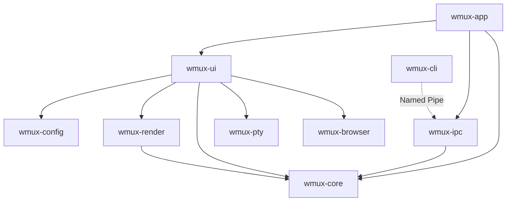

# wmux

[](./LICENSE)
[](https://www.rust-lang.org/)
[](https://www.microsoft.com/windows)

GPU-accelerated terminal multiplexer for Windows, split panes, workspaces, integrated browser, and IPC for AI agents.

[Quick Start](#quick-start) · [Features](#features) · [Architecture](#architecture) · [CLI](#cli) · [Docs](./docs/)

---

## About

wmux brings the [cmux](https://github.com/nichochar/cmux) experience to Windows. It's a native terminal multiplexer built in Rust with Direct3D 12 rendering, designed for developers running AI agents (Claude Code, Codex, OpenCode, Gemini CLI) who need split panes, real-time workspace metadata, an integrated browser, and full programmatic control, all in one window.

AI agents compatible with cmux work with wmux with minimal adaptation (Named Pipes instead of Unix sockets, same JSON-RPC v2 protocol).

---

## Features

| Feature | Description |
|---------|-------------|
| **GPU Terminal** | wgpu/Direct3D 12 rendering, VTE parsing, <16ms input-to-display latency, ligatures, emoji, Nerd Fonts |
| **Split Panes** | Horizontal/vertical splits, draggable dividers, zoom toggle, directional focus navigation |
| **Workspaces** | Vertical sidebar (expanded + collapsed icon-only mode) with git branch, port badges, agent status, inline rename |
| **Surfaces** | Tabs within each pane (terminal or browser) with keyboard cycling, shell/browser segmented toggle, right-click context menu |
| **Custom Title Bar** | GPU-rendered title bar with Codicons chrome buttons (min/max/restore/close), drag/snap via WM_NCHITTEST, DWM shadow preserved |
| **Integrated Browser** | WebView2 (Chromium) panes alongside terminals, address bar with auto-https + DuckDuckGo search fallback, scriptable via IPC (CLI wrapper partial, 7 of 30+ automation methods surfaced) |
| **Command Palette** | Ctrl+Shift+P fuzzy-search over commands, workspaces, and surfaces with filter tabs |
| **CLI & IPC** | 80+ JSON-RPC v2 commands over Named Pipes, HMAC-SHA256 auth, cmux-compatible protocol |
| **Session Persistence** | Auto-save every 8s, restore layout + scrollback on relaunch |
| **Terminal Search** | Ctrl+F in-pane search with regex support and match highlighting |
| **Notifications** | Notification panel (Ctrl+Shift+I) with severity-colored items, sidebar badges with unread count, WinRT Toast, OSC detection (CLI `notify` commands stub, pending L3_08) |
| **Theme Engine** | Ghostty-compatible config format, bundled themes (Digital Obsidian, Stitch Blue, etc.), full color pipeline, focus glow halo on active pane |
| **i18n** | English + French, system locale detection, manual override in config |
| **Auto-Update** | GitHub Releases update checks with SHA-256 checksum verification, HTTPS allowlist, 200MB download cap |
| **SSH Remote** | Remote workspace model + CLI commands (stub, pending Go daemon integration) |

---

## Quick Start

### Prerequisites

- Windows 10 1809+ (Windows 11 recommended for Mica/Acrylic effects)
- [Rust 1.80+](https://rustup.rs/)
- [WebView2 Runtime](https://developer.microsoft.com/en-us/microsoft-edge/webview2/) (pre-installed on Windows 11)

### Build from source

```bash
git clone https://github.com/Kazsuto/wmux.git
cd wmux
cargo build --release
```

### Run

```bash
# Start the terminal multiplexer
cargo run -p wmux-app

# Use the CLI client (in a separate terminal)
cargo run -p wmux-cli -- system ping
```

> [!TIP]
> Set `WMUX_SOCKET_PATH` to override the default Named Pipe path, or use `--pipe` with the CLI.

---

## CLI

wmux ships with a full CLI client for programmatic control:

```bash
# Workspace management
wmux workspace list
wmux workspace create --name "backend"
wmux workspace select --index 2

# Split panes
wmux surface split --direction right
wmux surface split --direction down

# Send input to a pane
wmux surface send-text --text "cargo test"
wmux surface send-key --key Enter

# Read terminal content
wmux surface read-text --surface-id <id>

# Browser control
wmux browser open --url "http://localhost:3000"

# SSH remote (daemon integration pending)
wmux ssh connect user@host
```

Output is human-readable by default. Add `--json` for machine-parseable output, ideal for AI agents.

<details>
<summary><strong>Full command reference</strong></summary>

| Namespace | Commands |
|-----------|----------|
| `system` | `ping`, `capabilities`, `identify` |
| `workspace` | `list`, `create`, `current`, `select`, `close`, `rename` |
| `surface` | `split`, `list`, `focus`, `close`, `send-text`, `send-key`, `read-text` |
| `browser` | `open`, `navigate`, `back`, `forward`, `reload`, `url`, `eval` (IPC exposes 30+ automation methods not yet surfaced in the CLI) |
| `sidebar` | `set-status`, `clear-status`, `list-status`, `set-progress`, `clear-progress`, `log`, `clear-log`, `list-log`, `state` |
| `notify` | `create`, `list`, `clear` (stubs, pending L3_08 integration) |
| `ssh` | `connect`, `disconnect` (stub, pending Go daemon) |

</details>

---

## Architecture



| Crate | Responsibility |
|-------|---------------|
| `wmux-core` | Terminal state, VTE parsing, cell grid, scrollback, domain models, focus routing |
| `wmux-pty` | ConPTY spawn/resize/I/O, shell detection (pwsh, powershell, cmd) |
| `wmux-render` | wgpu surface, glyphon text atlas, QuadPipeline, dirty-row rendering |
| `wmux-ui` | winit event loop, split pane layout, sidebar, overlays, input dispatch |
| `wmux-ipc` | Named Pipes server, JSON-RPC v2, HMAC auth, 80+ command handlers |
| `wmux-cli` | CLI binary (clap 4), Named Pipe client, human + JSON output |
| `wmux-browser` | WebView2 COM lifecycle, child HWND, automation API |
| `wmux-config` | Ghostty-compat config parser, theme engine, locale detection |
| `wmux-app` | Entry point — wires all crates, starts IPC, runs event loop |

> [!NOTE]
> Full C4 diagrams, ADRs, and component relations available in [docs/architecture/](./docs/architecture/INDEX.md).

---

## Keyboard Shortcuts

| Shortcut | Action |
|----------|--------|
| `Ctrl+D` | Split pane right |
| `Alt+D` | Split pane down |
| `Ctrl+W` | Close pane |
| `Ctrl+Shift+W` | Close workspace |
| `Ctrl+Shift+Enter` | Toggle zoom |
| `Alt+Arrows` | Focus navigation |
| `Ctrl+N` | New workspace |
| `Ctrl+1-9` | Switch workspace |
| `Ctrl+T` | New surface (tab) |
| `Ctrl+Shift+L` | New browser surface |
| `Ctrl+Tab` | Cycle surfaces |
| `Ctrl+B` | Toggle sidebar |
| `Ctrl+Shift+P` | Command palette |
| `Ctrl+F` | Search in terminal |
| `Ctrl+Shift+I` | Notification panel |
| `Ctrl+Shift+U` | Jump to last unread |
| `Ctrl+Shift+C/V` | Copy / Paste |

---

## Development

```bash
# Build all crates
cargo build --workspace

# Run tests
cargo test --workspace

# Lint (zero warnings policy)
cargo clippy --workspace -- -W clippy::all

# Format
cargo fmt --all
```

<details>
<summary><strong>Project structure</strong></summary>

```text
wmux/
├── wmux-app/        # Application entry point
├── wmux-core/       # Terminal engine & domain models
├── wmux-pty/        # ConPTY management
├── wmux-render/     # GPU rendering (wgpu + glyphon)
├── wmux-ui/         # Window management (winit)
├── wmux-ipc/        # IPC server (Named Pipes + JSON-RPC v2)
├── wmux-cli/        # CLI client (clap 4)
├── wmux-browser/    # WebView2 integration
├── wmux-config/     # Configuration & themes
├── docs/            # PRD, architecture, test plan
└── specs/           # 50 implementation task specs
```

</details>

---

## Roadmap

- [x] GPU-accelerated terminal with VTE parsing
- [x] Split panes with draggable dividers
- [x] Workspaces with sidebar metadata
- [x] Surface tabs (terminal + browser)
- [x] JSON-RPC v2 IPC with HMAC auth
- [x] CLI client (80+ commands)
- [x] WebView2 integrated browser
- [x] Session auto-save/restore
- [x] Terminal search with regex
- [x] Notification panel with severity & OSC detection
- [x] Command palette with filter tabs
- [x] Ghostty-compat theme engine (8 bundled themes)
- [x] Auto-update from GitHub Releases (SHA-256 + HTTPS allowlist)
- [x] i18n (English + French)
- [x] Custom title bar with Codicons chrome buttons
- [x] Sidebar collapsed (icon-only) mode
- [x] Focus glow halo on active pane
- [ ] Typography: bundle Inter font for UI chrome
- [ ] Sidebar progress bar UI rendering (backend + CLI ready)
- [ ] Config-driven custom keybindings (parser ready, wiring pending)
- [ ] F12 DevTools handler wiring (shortcut + COM API ready)
- [ ] CLI browser automation full coverage (25+ subcommands)
- [ ] CLI notify commands (stubs today)
- [ ] SSH remote (model ready, Go daemon integration pending)
- [ ] Performance profiling & optimization

---

## Contributing

1. Fork the repository
2. Create a feature branch (`git checkout -b feat/my-feature`)
3. Run quality checks: `cargo clippy --workspace -- -W clippy::all && cargo fmt --all && cargo test --workspace`
4. Commit and open a Pull Request

See [specs/README.md](./specs/README.md) for the full task breakdown and implementation waves.

---

## License

[MIT](./LICENSE)

<!-- GitHub "About" description: GPU-accelerated terminal multiplexer for Windows, split panes, workspaces, integrated browser, and IPC for AI agents. Built in Rust. -->
