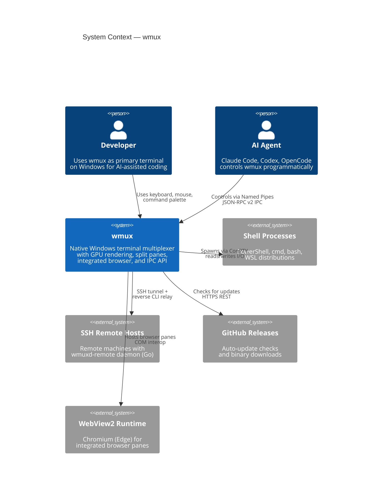
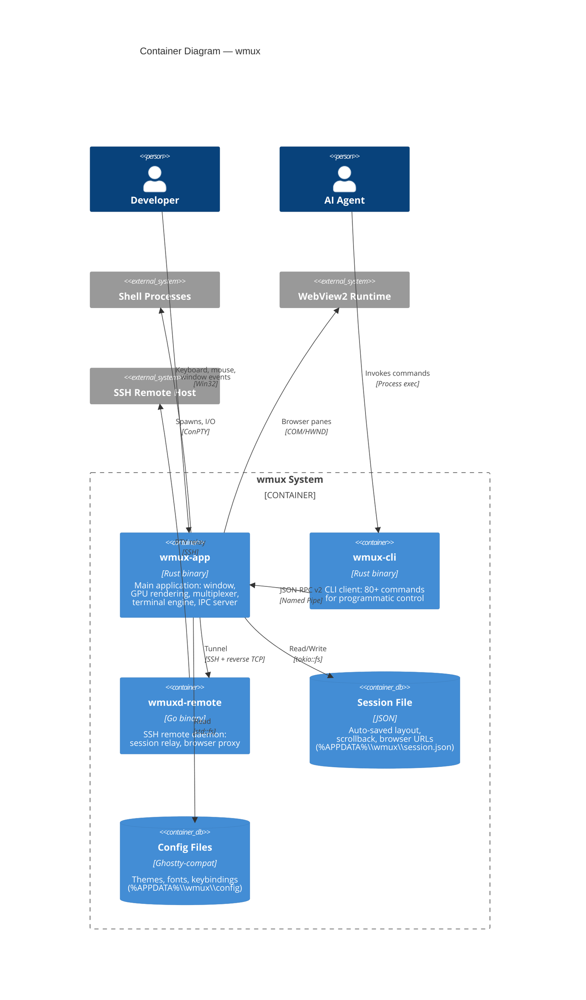
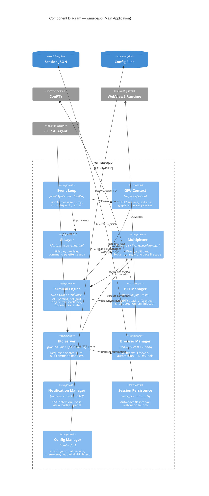
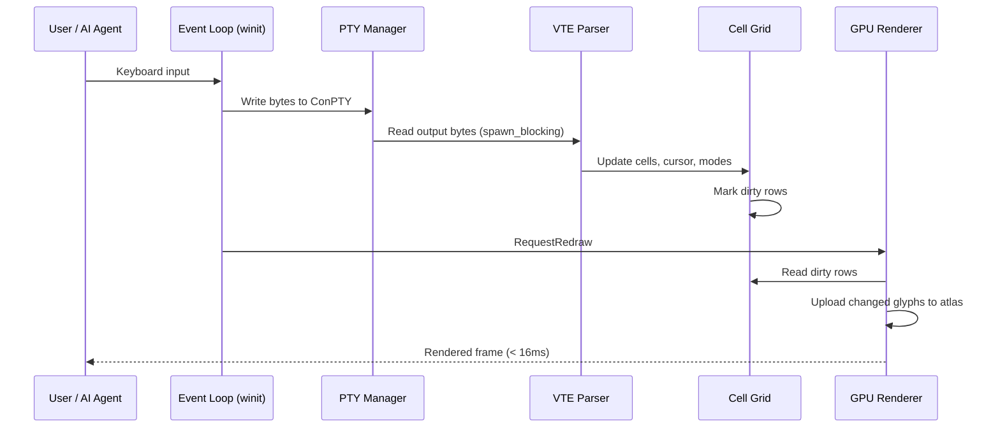
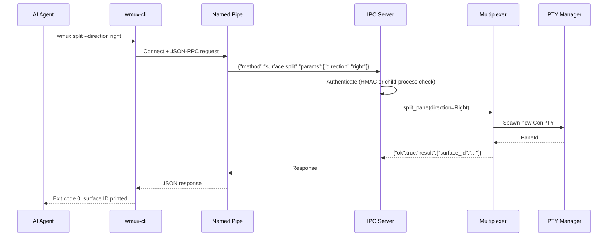
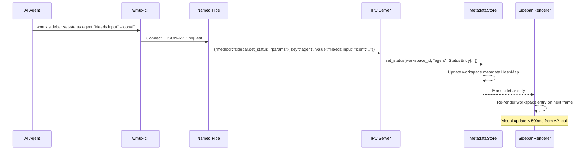

# Technical Architecture: wmux — Windows Terminal Multiplexer

> **Version**: 3.0 | **Status**: Accepted | **Owner**: wmux team | **Last updated**: 2026-03-19

## 1. Goals and Non-Goals

### Goals
- Reproduce the cmux experience on Windows — a native, GPU-accelerated terminal multiplexer optimized for AI agent workflows (Claude Code, Codex, OpenCode)
- Provide a single-window development environment: split panes, workspaces, integrated browser, CLI/IPC control, notifications
- Achieve ~95% protocol compatibility with cmux so existing AI agents work with minimal adaptation
- Ship as a free, open-source (MIT) desktop application for Windows 10 1809+

### Non-Goals (v1)
- macOS or Linux support — wmux v1 is Windows-only
- Plugin/extension system — no third-party API in v1
- Theme marketplace — themes loaded locally only
- Telemetry or analytics — no data collection in v1
- Full CJK IME support — basic via winit, improvements in v2
- Screen reader accessibility — basic support, incremental in v2
- Microsoft Store distribution — GitHub Releases, winget, Scoop only

### Quality Attributes
| Attribute | Target | Measurement |
|-----------|--------|-------------|
| Input-to-display latency | < 16ms (60fps) | Frame timing via `tracing` spans |
| Render frame budget | < 16ms | GPU profiling (PIX/RenderDoc) |
| Scrollback search | < 100ms on 4K lines | Benchmark test with `criterion` |
| IPC round-trip | < 5ms (Named Pipe local) | End-to-end latency measurement |
| Browser pane open | < 1s | Stopwatch from IPC command to ready |
| Notification delivery | < 2s from OSC/CLI event | Event timestamp delta |
| Session restore | < 3s for 10 workspaces | Startup profiling |
| Crash rate | < 1/week intensive use | User reports + panic handler logs |
| Memory (idle, 1 pane) | < 80MB RSS | Windows Task Manager |
| Memory (10 panes, 3 workspaces) | < 250MB RSS | Windows Task Manager |
| Binary size (wmux-app) | < 15MB (stripped release) | CI artifact size |
| Binary size (wmux-cli) | < 5MB (stripped release) | CI artifact size |

## 2. Stakeholders

| Role | Concern | How this doc serves them |
|------|---------|------------------------|
| AI Agent Developers | IPC protocol compatibility, CLI commands | §5 IPC component, §6 data flow, ADR-0005 |
| End Users (developers) | Performance, reliability, ease of use | §1 quality attributes, §11 failure modes |
| Contributors | Where to start, how crates fit together | §4 C4 diagrams, §5 components, §13 structure |
| Maintainers | Upgrade paths, dependency health | §3 stack, ADRs with revisit triggers |

## 3. Architecture Overview

**Project Type**: Native Windows desktop application (terminal multiplexer)
**Philosophy**: Rebuild cmux's architecture and protocol for Windows using Rust and the Windows platform ecosystem. Start simple (single-pane terminal), layer complexity incrementally (multiplexer → IPC → browser → polish). Prefer battle-tested crates over custom code. Optimize for the AI agent developer workflow.

**Stack Summary**:
| Layer | Choice | Version | Why |
|-------|--------|---------|-----|
| Language | Rust | 1.80+ (edition 2021) | Memory safety, terminal ecosystem (WezTerm, Alacritty, Rio), async (tokio) |
| GPU Rendering | wgpu | 28 | WebGPU → Direct3D 12 on Windows, cross-platform potential, used by WezTerm |
| Text Rendering | glyphon | 0.10 | Standard wgpu text renderer, built on cosmic-text/swash, used by COSMIC Terminal |
| Windowing | winit | 0.30 | Mature cross-platform abstraction over Win32, stable ApplicationHandler API |
| Terminal Parsing | vte | 0.13 | Alacritty's VT escape sequence parser, battle-tested |
| PTY | portable-pty | 0.9 | ConPTY abstraction from WezTerm project, handles Win10 1809+ |
| Async Runtime | tokio | 1.x | De facto Rust async runtime, full-featured (IO, timers, sync) |
| IPC | Named Pipes + JSON-RPC v2 | — | Windows equivalent of Unix sockets, cmux protocol compat |
| Browser | WebView2 via webview2-com | 0.39 | Chromium (Edge) pre-installed on Win10/11, full web compat |
| Win32 APIs | windows | 0.62 | Microsoft's official Rust bindings for DWM, Toast, COM |
| CLI Framework | clap | 4 | Standard Rust CLI parser, derive macros |
| Serialization | serde + serde_json | 1 | De facto serialization, JSON-RPC + persistence |
| Logging | tracing | 0.1 | Structured async-aware logging with span-based profiling |
| Error Handling | thiserror (libs) / anyhow (bins) | 2 / 1 | Typed errors in libraries, ergonomic propagation in binaries |
| SSH Daemon | Go (cmuxd-remote) | — | Already cross-platform, reused from cmux as-is |

### Cross-Cutting Concerns

| Concern | Approach | Details |
|---------|----------|---------|
| Error handling | `thiserror 2` (libs) / `anyhow 1` (bins) | Typed errors in library crates, `.context()` propagation in binaries. Never bare `unwrap()` — use `expect("reason")` for invariants |
| Logging | `tracing 0.1` structured spans | `RUST_LOG=wmux=debug`. Structured fields, no `println!`. Compatible with `tracy` profiler |
| Internationalization | Locale TOML files | `resources/locales/{en,fr}.toml`. English fallback. System language detection via `GetUserDefaultUILanguage` |
| Clipboard | `arboard 3` | `Ctrl+Shift+C` / `Ctrl+Shift+V` (avoids conflict with terminal `Ctrl+C` SIGINT) |
| Testing | `#[cfg(test)]` + `cargo clippy` | Zero warnings policy. CI gate: clippy -> fmt -> test -> build. See `.claude/rules/testing.md` |

## 4. System Architecture (C4 Model)

### Level 1: System Context



### Level 2: Container Diagram



### Level 3: Component Diagram — wmux-app



## 5. Component Breakdown

### wmux-core — Terminal State & Domain Model
- **Responsibility**: VTE parsing, cell grid, scrollback buffer, cursor/mode state, workspace/pane domain models, notification store, focus routing logic
- **Technology**: vte 0.13, serde 1, thiserror 2, tracing 0.1
- **Interfaces**: Pure Rust library. Consumed by wmux-render (grid data), wmux-ui (layout/focus), wmux-ipc (command handlers), wmux-app (wiring)
- **Why vte**: Alacritty's battle-tested VT parser. Zero-copy, state-machine based, handles malformed sequences gracefully
- **Design patterns**: State machine (terminal modes), Observer (dirty row flags for renderer), Actor-ready (grid state owned by terminal, exposed via methods)
- **Trade-off**: vte is lower-level than alternatives (no built-in grid) — requires manual grid/scrollback implementation, but gives full control needed for a terminal multiplexer

### wmux-pty — ConPTY Abstraction
- **Responsibility**: Spawn shell processes via ConPTY, manage I/O pipes, resize, shell detection, environment variable injection
- **Technology**: portable-pty 0.9, tokio (spawn_blocking for PTY reads)
- **Interfaces**: `PtyManager` struct with async spawn/read/write/resize. Consumed by wmux-core (terminal engine)
- **Why portable-pty 0.9**: WezTerm's production-grade ConPTY wrapper. Handles Win10 1809+ quirks. v0.9 has latest fixes
- **Trade-off**: Depends on WezTerm's maintenance pace. Alternative `xpty` adds native async but is too immature (watching for v1.0)

### wmux-render — GPU Rendering Pipeline
- **Responsibility**: wgpu surface management, glyphon text atlas, terminal grid rendering (dirty rows → GPU upload), cursor rendering, UI chrome rendering (sidebar, overlays)
- **Technology**: wgpu 28, glyphon 0.10, bytemuck 1, tracing 0.1
- **Interfaces**: `GpuContext` (surface lifecycle), `GlyphonRenderer` (text rendering), `QuadPipeline` (colored rectangles for UI). Consumed by wmux-ui
- **Why wgpu 28 + glyphon 0.10**: wgpu maps to D3D12 natively on Windows. glyphon is the standard wgpu text renderer (cosmic-text + swash + etagere under the hood). Staying on wgpu 28 because glyphon 0.10 depends on it — upgrade both together when glyphon publishes a wgpu 29-compatible release
- **Design patterns**: Retained-mode rendering (cache glyph atlas across frames), dirty-flag updates (only upload changed rows)
- **Trade-off**: Custom renderer is more work than iced/egui, but necessary for 60fps terminal grid rendering. Validated by WezTerm, Rio, COSMIC Terminal

### wmux-ui — Window Management & Layout
- **Responsibility**: winit event loop integration, split pane layout engine, sidebar rendering, command palette overlay, search overlay, keyboard/mouse input dispatch, drag-and-drop
- **Technology**: winit 0.30, wmux-render, wmux-core
- **Interfaces**: `App` struct implementing winit `ApplicationHandler`. Owns all render state and multiplexer state. Entry point for the application
- **Why winit 0.30**: Mature, stable Win32 abstraction. 0.30.x is the stable line (0.31 still beta). `ApplicationHandler` trait is the modern event loop API
- **Trade-off**: winit handles windowing but not UI widgets — all UI (sidebar, overlays, palette) must be custom wgpu-rendered. More work, but no framework lock-in

### wmux-ipc — Named Pipes Server & JSON-RPC v2
- **Responsibility**: Named Pipe server (`\\.\pipe\wmux-*`), JSON-RPC v2 protocol (cmux-compatible), HMAC-SHA256 authentication, security modes, request routing, 80+ command handlers
- **Technology**: tokio (async Named Pipes), serde_json, windows 0.62 (pipe ACLs), thiserror 2
- **Interfaces**: `IpcServer` actor (bounded channel + dedicated tokio task). Receives JSON-RPC requests, dispatches to `Handler` trait implementations, returns responses
- **Why Named Pipes + JSON-RPC v2**: Named Pipes are the Windows equivalent of Unix domain sockets — no port conflicts, ACL security, lower latency than TCP loopback. JSON-RPC v2 matches cmux protocol for AI agent compatibility
- **Design patterns**: Actor pattern (channel-based, not Arc<Mutex>), Handler trait (one impl per domain: workspace.*, surface.*, browser.*)
- **Trade-off**: Named Pipes are Windows-only. If wmux ever goes cross-platform, IPC layer needs an abstraction (Unix sockets on Linux/macOS)

### wmux-cli — CLI Client Binary
- **Responsibility**: `wmux.exe` CLI with 80+ commands (list, select, split, send, notify, etc.), Named Pipe client, JSON-RPC request construction, human-readable and machine-readable output
- **Technology**: clap 4 (derive), serde_json, tokio (async pipe client), anyhow
- **Interfaces**: Standalone binary. Connects to wmux-app via Named Pipe, sends one-shot JSON-RPC requests. Discoverable via `WMUX_SOCKET_PATH` env var
- **Why clap 4**: De facto Rust CLI framework. Derive macros for zero-boilerplate subcommands. Shell completions for free
- **Trade-off**: One-shot connections (connect → send → receive → disconnect) add connection overhead per command but simplify state management

### wmux-browser — WebView2 Integration
- **Responsibility**: WebView2 COM initialization (RAII wrappers), child HWND management, URL navigation, JavaScript evaluation, DevTools, screenshot/PDF, cookie/storage control, show/hide on workspace switch
- **Technology**: webview2-com 0.39, windows 0.62, raw-window-handle
- **Interfaces**: `BrowserManager` struct. Created by wmux-ui when a browser pane is requested. Positioned/sized by the split container. Automation API exposed via wmux-ipc handlers
- **Why webview2-com 0.39**: 1M+ downloads/month, actively maintained, used by Tauri. Exposes 100% of WebView2 COM API. The older `webview2` crate (0.1.4) is abandoned
- **Design patterns**: Separate child HWND (NEVER inside wgpu surface), RAII Drop for COM cleanup
- **Trade-off**: WebView2 runtime must be installed (pre-installed on Win10 20H2+ and all Win11). Older Win10 builds need the Evergreen Bootstrapper

### wmux-config — Configuration Parsing
- **Responsibility**: Ghostty-compatible config file parsing (`key = value` format), theme loading, font configuration, dark/light mode detection, locale detection, default config generation
- **Technology**: toml 0.8, serde 1, dirs 6, windows 0.62 (registry for dark/light mode)
- **Interfaces**: `Config` struct (deserialized from TOML). `ThemeEngine` for color palette management. Consumed by wmux-render (colors, fonts) and wmux-ui (keybindings, locale)
- **Why Ghostty-compatible format**: Reuse 50+ existing Ghostty themes. Familiar to cmux users
- **Trade-off**: Not standard TOML semantics — Ghostty uses `key = value` without sections. Requires custom parser layer on top of TOML

### wmux-app — Main Application Binary
- **Responsibility**: Entry point. Wires all crates together: initializes tracing, loads config, starts IPC server, creates window, runs event loop. Graceful shutdown coordination
- **Technology**: anyhow, tracing-subscriber, tokio, all internal crates
- **Interfaces**: `main()` → `App::run()`. Owns the tokio runtime and winit event loop
- **Design pattern**: Composition root — no business logic, only wiring

### wmuxd-remote — SSH Remote Daemon (Go)
- **Responsibility**: Runs on remote machines. Manages durable remote sessions, PTY relay, browser proxy (SOCKS5/HTTP CONNECT), CLI relay (reverse TCP forward), multi-client resize coordination
- **Technology**: Go (reused from cmux, already cross-platform)
- **Interfaces**: Bootstrapped by `wmux ssh` command. Communicates with wmux-app over SSH tunnel
- **Why reuse Go daemon**: Already works on Linux/macOS/Windows. ~3K lines. Rewriting in Rust would add months with no functional benefit
- **Trade-off**: Two languages in the project (Rust + Go). Go daemon compiled separately, bundled as a binary resource

## 6. Data Architecture

### Data Model
- **Type**: Document (JSON for session), Key-Value (TOML for config), In-Memory (grid cells, scrollback)
- **Persistence**: Local filesystem only — no database, no network storage
- **Storage Location**: `%APPDATA%\wmux\` (Windows standard for user application data)

### Data Flow — Terminal I/O (Critical Path)



### Data Flow — IPC Command



### Session Persistence Schema
```json
{
  "version": 1,
  "workspaces": [
    {
      "id": "ws-uuid",
      "name": "project-x",
      "pane_tree": {
        "type": "split",
        "direction": "horizontal",
        "ratio": 0.5,
        "children": [
          { "type": "terminal", "surface_id": "s-uuid", "cwd": "C:\\Users\\dev\\project-x", "scrollback_lines": 2000 },
          { "type": "browser", "surface_id": "s-uuid2", "url": "http://localhost:3000" }
        ]
      },
      "metadata": { "git_branch": "main", "git_dirty": false }
    }
  ],
  "active_workspace": "ws-uuid",
  "sidebar_width": 220,
  "window": { "x": 100, "y": 100, "width": 1920, "height": 1080, "maximized": true }
}
```

- **Auto-save interval**: 8 seconds (non-blocking: serialize on main thread, write via `tokio::spawn`)
- **Scrollback limit**: 4000 lines / 400K chars per terminal (truncated before serialization)
- **Schema versioning**: `"version": 1` at root. Incompatible versions → start fresh, never crash
- **Corruption handling**: Invalid JSON → log warning, start fresh session

### Sidebar Metadata Model

Three metadata types per workspace, managed by the `MetadataStore` and exposed via IPC:

**Statuses** (keyed badges with icon and color):
```json
{
  "agent": { "value": "Needs input", "icon": "🔵", "color": "blue" },
  "build": { "value": "Build OK", "icon": "✅", "color": "green" }
}
```

**Progress** (0.0-1.0 with optional label):
```json
{ "value": 0.75, "label": "Build 75%" }
```

**Logs** (timestamped entries with level and source):
```json
[
  { "timestamp": "2026-03-19T14:32:00Z", "level": "info", "source": "claude", "message": "File created src/main.rs" },
  { "timestamp": "2026-03-19T14:32:05Z", "level": "success", "source": "build", "message": "Compilation succeeded in 3.2s" }
]
```

Log levels: `info`, `progress`, `success`, `warning`, `error`. Logs capped at 100 entries per workspace (oldest evicted).

### Data Flow — Sidebar Metadata Update



**PID-aware lifecycle**: The MetadataStore tracks the PID of the process that set each status. A sweep timer (30s) checks if tracked PIDs are still alive. Dead process statuses (e.g., "Needs input" from a terminated Claude Code) are automatically cleared.

## 7. Security Architecture

### IPC Security Modes
| Mode | Access | Activation | Use Case |
|------|--------|------------|----------|
| `wmux-only` (default) | Only child processes spawned by wmux | Settings UI | Secure — agents running inside wmux auto-authenticate |
| `password` | HMAC-SHA256 challenge-response | Settings UI | High security, remote CLI relay |
| `allowAll` | Any local process from same user | `WMUX_SOCKET_MODE=allowAll` | External automation scripts, development |
| `off` | Disabled | `WMUX_SOCKET_MODE=off` | Completely disable IPC |

### Authentication Flow (password mode)
1. Client connects to Named Pipe
2. Client calls `system.ping` (allowed unauthenticated)
3. Server returns challenge nonce
4. Client computes `HMAC-SHA256(secret, nonce)` and calls `auth.login`
5. Server verifies → grants session token
6. All subsequent requests include session token

### Data Protection
- **Auth secret**: Auto-generated in `%APPDATA%\wmux\auth_secret`, restricted file permissions (owner-only ACL). NEVER stored in config file. NEVER logged
- **Named Pipes ACL**: Default DACL restricts to current user SID
- **Scrollback in persistence**: Stored as plaintext JSON — users are responsible for disk encryption if needed. No sensitive data in session file by design (no passwords, no tokens)
- **WebView2 isolation**: Browser runs in Edge's sandboxed process model. JavaScript eval API validates caller is the IPC server

### Input Validation
- JSON-RPC: All incoming JSON validated against expected schema before dispatch
- Shell commands: `surface.send_text` transmits raw bytes — responsibility is on the caller (same as cmux design)
- File paths: Config/session paths canonicalized, no directory traversal

## 8. Observability

- **Logging**: `tracing` crate with `tracing-subscriber` (EnvFilter). Structured fields, not format strings. `RUST_LOG=wmux=debug` for development
- **Performance profiling**: Span-based tracing in render loop and IPC handlers. Compatible with `tracy` profiler via `tracing-tracy`
- **Crash diagnostics**: Custom panic handler logs stack trace to `%APPDATA%\wmux\crash.log` with timestamp. Optional Sentry integration in post-MVP
- **IPC debugging**: `--json` flag on CLI for machine-readable output. `system.tree` command dumps full state tree

## 9. Infrastructure & Distribution

- **Platform**: Windows 10 1809+ (ConPTY requirement). Windows 11 for Mica/Acrylic effects (opaque fallback on Win10)
- **Build**: `cargo build --release` with LTO, single codegen unit, symbols stripped, panic=abort
- **CI/CD**: GitHub Actions (windows-latest runner). Steps: clippy → fmt → test → build → package
- **Distribution**:
  - MSI installer (via WiX or cargo-wix)
  - winget manifest (Microsoft package manager)
  - Scoop bucket (developer-friendly)
  - Portable .zip (no install required)
- **Auto-update**: GitHub Releases API poll (background, hourly). Download staged to temp. Notification in title bar. User-initiated install

## 10. Failure Modes & Resilience

| Failure scenario | Impact | Degradation behavior | Recovery strategy |
|-----------------|--------|---------------------|-------------------|
| ConPTY spawn fails | Single pane broken | Error message in pane area, other panes unaffected | Retry with fallback shell (cmd.exe) |
| GPU adapter unavailable | App cannot start | Log error, show Win32 MessageBox with system requirements | User must update GPU drivers or use software renderer |
| wgpu surface lost (Alt+Tab, sleep) | Frame glitch | Skip frame, reconfigure surface on next redraw | Automatic via wgpu `SurfaceError::Lost` handling |
| WebView2 runtime missing | Browser panes unavailable | Terminal panes work normally. Browser commands return clear error | Prompt user to install Edge WebView2 Evergreen Runtime |
| Named Pipe server bind fails | No IPC/CLI | App runs standalone without programmatic control | Retry with unique pipe name (wmux-{pid}), log warning |
| Session file corrupt | Session not restored | Log warning, start fresh session | Auto-save overwrites corrupt file within 8 seconds |
| PTY process crash (shell exit) | Single pane shows exit code | Display "[Process exited with code N]", pane stays open | User closes or respawns shell in same pane |
| SSH connection drop | Remote workspace frozen | Sidebar shows disconnect icon, auto-reconnect with backoff | Reconnect restores session from remote daemon state |
| Out of memory (massive scrollback) | OOM risk | Scrollback hard-capped at 4K lines / 400K chars per terminal | Oldest lines evicted from ring buffer. Config to reduce limit |
| DWM compositor disabled | Mica/Acrylic broken | Feature-detect → fallback to opaque background | Automatic, no user action needed |

## 11. Architecture Decision Records

ADRs are stored as separate files in `decisions/`. Each follows the MADR template.

| ADR | Title | Status | Confidence |
|-----|-------|--------|------------|
| [ADR-0001](decisions/0001-language-rust.md) | Language: Rust | Accepted | High |
| [ADR-0002](decisions/0002-gpu-rendering-custom-wgpu.md) | GPU Rendering: Custom wgpu pipeline (not iced/egui) | Accepted | High |
| [ADR-0003](decisions/0003-text-rendering-glyphon.md) | Text Rendering: glyphon 0.10 | Accepted | Medium |
| [ADR-0004](decisions/0004-pty-backend-portable-pty.md) | PTY Backend: portable-pty (ConPTY) | Accepted | High |
| [ADR-0005](decisions/0005-ipc-named-pipes-jsonrpc.md) | IPC: Named Pipes + JSON-RPC v2 | Accepted | High |
| [ADR-0006](decisions/0006-browser-webview2.md) | Browser: WebView2 via webview2-com | Accepted | High |
| [ADR-0007](decisions/0007-windowing-winit.md) | Windowing: winit 0.30 | Accepted | Medium |
| [ADR-0008](decisions/0008-async-actor-pattern.md) | Async Architecture: Actor pattern via bounded channels | Accepted | High |
| [ADR-0009](decisions/0009-session-persistence-json.md) | Session Persistence: JSON file with auto-save | Accepted | High |
| [ADR-0010](decisions/0010-config-format-ghostty.md) | Config Format: Ghostty-compatible key-value | Accepted | Medium |

## 12. Project Structure (Target)

> **Note**: This is the target project structure. Crates with implemented source files: wmux-render, wmux-ui, wmux-app. All other crates are stubs (`lib.rs` with comment only). See CHANGELOG.md for current implementation progress.

```
wmux/
├── Cargo.toml                    # Workspace root
├── Cargo.lock
├── CLAUDE.md                     # Claude Code project instructions
├── CHANGELOG.md
├── PRD.md                        # Product requirements
├── docs/
│   └── architecture/
│       ├── ARCHITECTURE.md       # This document
│       ├── decisions/            # ADR files (MADR format)
│       └── glossary.md           # Domain & technical terms
├── specs/                        # Implementation task specs (planned)
│   ├── README.md                 # Task overview + dependency map
│   └── 01-mvp/                   # Task files by phase
├── resources/
│   ├── locales/                  # i18n strings (en.toml, fr.toml)
│   ├── themes/                   # Bundled Ghostty themes
│   └── shell-integration/        # PowerShell/bash/zsh hook scripts
├── wmux-core/                    # Terminal state, VTE, grid, scrollback, domain models
│   ├── Cargo.toml
│   └── src/
│       ├── lib.rs
│       ├── terminal.rs           # Terminal state machine
│       ├── grid.rs               # Cell grid (contiguous Vec<Cell> per row)
│       ├── cell.rs               # Cell struct with attributes
│       ├── scrollback.rs         # Ring buffer (VecDeque)
│       ├── vte_handler.rs        # vte::Perform implementation
│       ├── pane_tree.rs          # Binary split tree
│       ├── workspace.rs          # Workspace model
│       ├── workspace_manager.rs  # Workspace lifecycle
│       ├── focus.rs              # Focus routing logic
│       ├── notification.rs       # NotificationStore
│       └── error.rs              # CoreError enum
├── wmux-pty/                     # ConPTY abstraction
│   ├── Cargo.toml
│   └── src/
│       ├── lib.rs
│       ├── manager.rs            # PtyManager (spawn, I/O, resize)
│       ├── shell.rs              # Shell detection (pwsh → powershell → cmd)
│       └── error.rs
├── wmux-render/                  # GPU rendering pipeline
│   ├── Cargo.toml
│   └── src/
│       ├── lib.rs
│       ├── gpu.rs                # GpuContext (wgpu surface, device, queue)
│       ├── text.rs               # GlyphonRenderer (text atlas, buffer, render)
│       ├── quad.rs               # QuadPipeline (colored rectangles)
│       ├── shader.wgsl           # WGSL shaders for quads
│       └── error.rs              # RenderError enum
├── wmux-ui/                      # Window management, layout, input
│   ├── Cargo.toml
│   └── src/
│       ├── lib.rs
│       ├── app.rs                # App (winit ApplicationHandler)
│       ├── input.rs              # Keyboard/mouse event dispatch
│       ├── sidebar.rs            # Sidebar rendering
│       ├── split_container.rs    # Split pane layout + dividers
│       ├── overlay.rs            # Command palette, search, notifications panel
│       └── error.rs              # UiError enum
├── wmux-ipc/                     # Named Pipes server, JSON-RPC
│   ├── Cargo.toml
│   └── src/
│       ├── lib.rs
│       ├── server.rs             # Named Pipe server (tokio async)
│       ├── protocol.rs           # JSON-RPC v2 codec
│       ├── auth.rs               # HMAC-SHA256 authentication
│       ├── router.rs             # Method dispatch (Handler trait)
│       └── handlers/             # One module per domain
│           ├── mod.rs
│           ├── system.rs         # system.* handlers
│           ├── workspace.rs      # workspace.* handlers
│           ├── surface.rs        # surface.* handlers
│           ├── pane.rs           # pane.* handlers
│           ├── browser.rs        # browser.* handlers
│           └── notification.rs   # notification.* handlers
├── wmux-cli/                     # CLI client binary
│   ├── Cargo.toml
│   └── src/
│       ├── main.rs
│       ├── client.rs             # Named Pipe client
│       └── commands/             # clap subcommands
├── wmux-browser/                 # WebView2 integration
│   ├── Cargo.toml
│   └── src/
│       ├── lib.rs
│       ├── manager.rs            # BrowserManager (lifecycle, HWND)
│       ├── automation.rs         # click, fill, eval, screenshot
│       ├── com.rs                # Safe RAII wrappers for COM
│       └── error.rs
├── wmux-config/                  # Configuration parsing
│   ├── Cargo.toml
│   └── src/
│       ├── lib.rs
│       ├── parser.rs             # Ghostty-compat config parser
│       ├── theme.rs              # Theme/color palette loading
│       ├── font.rs               # Font configuration
│       ├── keymap.rs             # Keybinding configuration
│       └── error.rs
├── wmux-app/                     # Main application binary
│   ├── Cargo.toml
│   └── src/
│       └── main.rs               # Entry point (wiring only)
└── daemon/                       # Go SSH remote daemon (reused from cmux)
    └── remote/
        └── cmd/wmuxd-remote/
```

## 13. Implementation Roadmap

### Phase 0: Infrastructure (Week 1)
1. winit/tokio event loop threading model integration
2. `thiserror` + `tracing` infrastructure for all crates (error types, structured logging)

### Phase 1: Foundation — Working Terminal (Weeks 2-9)
1. Terminal cell grid data structure with attributes and dirty tracking
2. VTE escape sequence parser → grid operations (vte `Perform` trait)
3. Terminal event bus (OSC sequences → application events)
4. Scrollback ring buffer (4K lines, VecDeque)
5. ConPTY shell spawning via portable-pty 0.9
6. Terminal rendering pipeline (grid cells → GPU glyphon rendering)
7. Keyboard input → PTY byte sequences
8. Mouse selection, copy/paste, scroll, mouse reporting
9. Phase 1 integration: wire all into a working single-pane terminal

**Milestone**: A functional terminal (like minimal Alacritty)

### Phase 2: Multiplexer (Weeks 6-12)
1. AppState refactor + QuadPipeline + multi-pane rendering
2. PaneId/WorkspaceId types + PaneRegistry
3. Binary tree pane layout engine + focus routing
4. Global keyboard shortcut priority dispatcher
5. Draggable dividers, pane rendering, resize
6. Workspace lifecycle, switching, metadata
7. Sidebar UI (workspace list, badges, drag-and-drop)

**Milestone**: A native terminal multiplexer (like tmux)

### Phase 3: IPC & CLI (Weeks 9-14)
1. AppState actor (bounded channel) + IPC wiring
2. Named Pipes server + JSON-RPC v2 protocol
3. HMAC-SHA256 auth + security modes
4. CLI client (`wmux.exe`) with core commands
5. Handler trait, Router, RpcError, ConnectionCtx
6. Full 80+ command handlers for all domains

**Milestone**: Full programmatic control — AI agents work

### Phase 4: Advanced Features (Weeks 11-20)
1. Session persistence (auto-save 8s + restore)
2. WebView2 COM initialization & RAII wrappers
3. WebView2 browser panel in split panes
4. Browser automation API (click, fill, eval, screenshot)
5. Notification system (OSC detection, Toast, badges, panel)
6. Ghostty-compatible config parser + theme engine
7. Shell integration hooks (PowerShell/bash/zsh)

**Milestone**: ~80% feature parity with cmux

### Phase 5: Polish (Weeks 17-24)
1. Command palette (Ctrl+Shift+P) with fuzzy search
2. Terminal search (Ctrl+F) with match highlighting
3. Git branch + dirty state detection in sidebar
4. SSH remote (Go daemon + wmux ssh + reconnection)
5. Auto-update (GitHub Releases + background download)
6. Mica/Acrylic effects (Win11 with opaque fallback)
7. Localization FR/EN (auto-detection + manual override)
8. Packaging (MSI, winget, Scoop, portable zip)

**Milestone**: Production-ready MVP release

## 14. Risks & Mitigations

| Risk | Impact | Likelihood | Mitigation |
|------|--------|-----------|------------|
| GPU text rendering complexity (glyph atlas, ligatures, emoji) | High | Medium | Study WezTerm (MIT) and Rio (MIT) renderers. glyphon handles atlas management. Start with ASCII-only, add Unicode incrementally |
| ConPTY edge cases (resize races, escape sequence differences vs Unix PTY) | Medium | Medium | portable-pty 0.9 handles known quirks. Extensive VTE conformance testing against vttest |
| WebView2 + wgpu HWND coordination (z-order, focus, resize sync) | Medium | Medium | Separate child HWND architecture avoids compositing conflicts. Tauri validates this approach |
| winit IME support on Windows (CJK input) | Medium | Medium | winit 0.30.x has partial IME via TSF. Defer full CJK to v2. Basic Latin input works |
| wgpu/glyphon version coupling | Low | High | Pin both versions together. Upgrade only when glyphon publishes matching release |
| cmux protocol drift (cmux evolves, wmux must track) | Medium | Medium | Abstract protocol layer. Track cmux releases. Maintain compatibility test suite |
| Single-developer bus factor | High | Medium | MIT license, thorough documentation, clean crate boundaries for contributor onboarding |
| WebView2 runtime not installed (old Win10) | Low | Low | Detect at startup, show install prompt. Browser features degrade gracefully |

## 15. Maintenance & Change Management

- **Documentation ownership**: wmux core team. This document lives in `docs/architecture/` and is versioned with the code
- **Review cadence**: Quarterly review, or when a major feature changes the architecture
- **Change process**: New architectural decision → draft ADR (Proposed) → PR review → merge (Accepted). Update main ARCHITECTURE.md to reflect new ADR
- **Dependency policy**: Patch updates freely. Minor/major updates require testing + CHANGELOG entry. Quarterly dependency audit (`cargo audit`, `cargo outdated`)
- **Testing strategy**: Unit tests in `#[cfg(test)]` modules. Zero clippy warnings policy. CI gate: clippy -> fmt -> test -> build. Detailed rules in `.claude/rules/testing.md`
- **Versioning**: SemVer. Pre-1.0 breaking changes allowed between minor versions. CHANGELOG.md updated with every change
