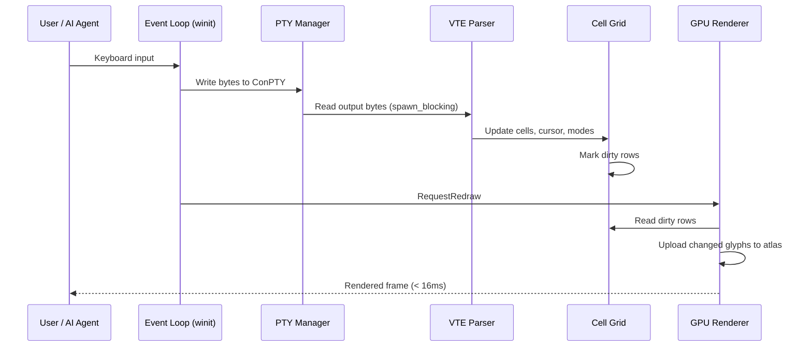
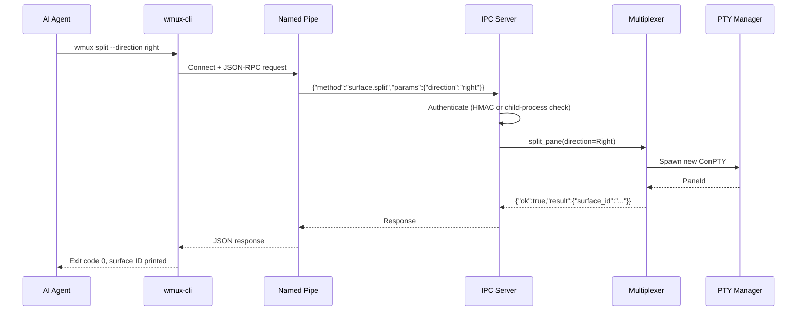
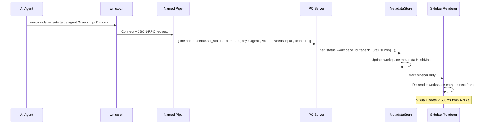

# Data Architecture, Security & Observability

> Part of [wmux Architecture](ARCHITECTURE.md). See also: [Component Relations](component-relations.md), [Feature Files](feature-files.md).

## 6. Data Architecture

### Data Model
- **Type**: Document (JSON for session), Key-Value (TOML for config), In-Memory (grid cells, scrollback)
- **Persistence**: Local filesystem only — no database, no network storage
- **Storage Location**: `%APPDATA%\wmux\` (Windows standard for user application data)

### Data Flow — Terminal I/O (Critical Path)



### Data Flow — IPC Command



### Session Persistence Schema
```json
{
  "version": 1,
  "workspaces": [
    {
      "id": "ws-uuid",
      "name": "project-x",
      "pane_tree": {
        "type": "split",
        "direction": "horizontal",
        "ratio": 0.5,
        "children": [
          { "type": "terminal", "surface_id": "s-uuid", "cwd": "C:\\Users\\dev\\project-x", "scrollback_lines": 2000 },
          { "type": "browser", "surface_id": "s-uuid2", "url": "http://localhost:3000" }
        ]
      },
      "metadata": { "git_branch": "main", "git_dirty": false }
    }
  ],
  "active_workspace": "ws-uuid",
  "sidebar_width": 220,
  "window": { "x": 100, "y": 100, "width": 1920, "height": 1080, "maximized": true }
}
```

- **Auto-save interval**: 8 seconds (non-blocking: serialize on main thread, write via `tokio::spawn`)
- **Scrollback limit**: 4000 lines / 400K chars per terminal (truncated before serialization)
- **Schema versioning**: `"version": 1` at root. Incompatible versions → start fresh, never crash
- **Corruption handling**: Invalid JSON → log warning, start fresh session

### Sidebar Metadata Model

Three metadata types per workspace, managed by the `MetadataStore` and exposed via IPC:

**Statuses** (keyed badges with icon and color):
```json
{
  "agent": { "value": "Needs input", "icon": "🔵", "color": "blue" },
  "build": { "value": "Build OK", "icon": "✅", "color": "green" }
}
```

**Progress** (0.0-1.0 with optional label):
```json
{ "value": 0.75, "label": "Build 75%" }
```

**Logs** (timestamped entries with level and source):
```json
[
  { "timestamp": "2026-03-19T14:32:00Z", "level": "info", "source": "claude", "message": "File created src/main.rs" },
  { "timestamp": "2026-03-19T14:32:05Z", "level": "success", "source": "build", "message": "Compilation succeeded in 3.2s" }
]
```

Log levels: `info`, `progress`, `success`, `warning`, `error`. Logs capped at 100 entries per workspace (oldest evicted).

### Data Flow — Sidebar Metadata Update



**PID-aware lifecycle**: The MetadataStore tracks the PID of the process that set each status. A sweep timer (30s) checks if tracked PIDs are still alive. Dead process statuses (e.g., "Needs input" from a terminated Claude Code) are automatically cleared.

> **See also**: [Component Relations](component-relations.md) for the complete data flow tables covering Terminal I/O, IPC commands, session persistence, and notification propagation paths.

## 7. Security Architecture

### IPC Security Modes
| Mode | Access | Activation | Use Case |
|------|--------|------------|----------|
| `wmux-only` (default) | Only child processes spawned by wmux | Settings UI | Secure — agents running inside wmux auto-authenticate |
| `password` | HMAC-SHA256 challenge-response | Settings UI | High security, remote CLI relay |
| `allowAll` | Any local process from same user | `WMUX_SOCKET_MODE=allowAll` | External automation scripts, development |
| `off` | Disabled | `WMUX_SOCKET_MODE=off` | Completely disable IPC |

### Authentication Flow (password mode)
1. Client connects to Named Pipe
2. Client calls `system.ping` (allowed unauthenticated)
3. Server returns challenge nonce
4. Client computes `HMAC-SHA256(secret, nonce)` and calls `auth.login`
5. Server verifies → grants session token
6. All subsequent requests include session token

### Data Protection
- **Auth secret**: Auto-generated in `%APPDATA%\wmux\auth_secret`, restricted file permissions (owner-only ACL). NEVER stored in config file. NEVER logged
- **Named Pipes ACL**: Default DACL restricts to current user SID
- **Scrollback in persistence**: Stored as plaintext JSON — users are responsible for disk encryption if needed. No sensitive data in session file by design (no passwords, no tokens)
- **WebView2 isolation**: Browser runs in Edge's sandboxed process model. JavaScript eval API validates caller is the IPC server

### Input Validation
- JSON-RPC: All incoming JSON validated against expected schema before dispatch
- Shell commands: `surface.send_text` transmits raw bytes — responsibility is on the caller (same as cmux design)
- File paths: Config/session paths canonicalized, no directory traversal

## 8. Observability

- **Logging**: `tracing` crate with `tracing-subscriber` (EnvFilter). Structured fields, not format strings. `RUST_LOG=wmux=debug` for development
- **Performance profiling**: Span-based tracing in render loop and IPC handlers. Compatible with `tracy` profiler via `tracing-tracy`
- **Crash diagnostics**: Custom panic handler logs stack trace to `%APPDATA%\wmux\crash.log` with timestamp. Optional Sentry integration in post-MVP
- **IPC debugging**: `--json` flag on CLI for machine-readable output. `system.tree` command dumps full state tree
