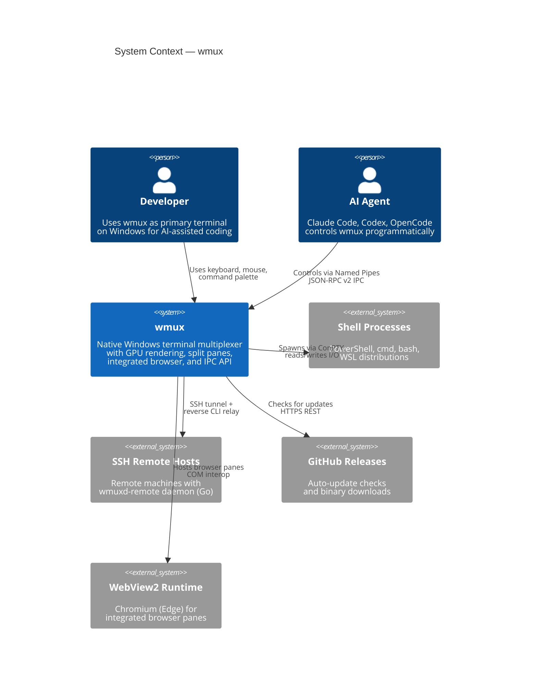
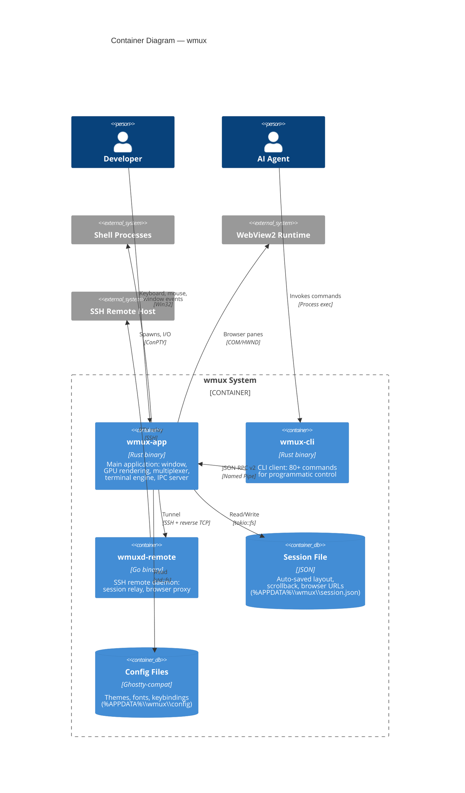
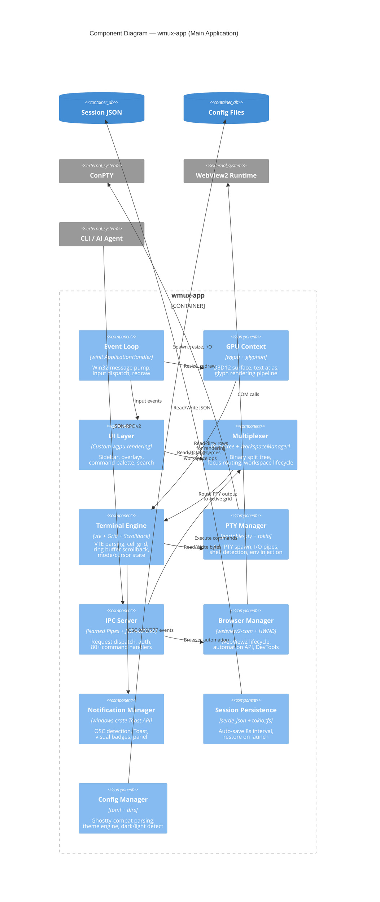

# System Architecture (C4 Model)

> Part of [wmux Architecture](ARCHITECTURE.md). See also: [Component Breakdown](ARCHITECTURE.md#5-component-breakdown), [Component Relations](component-relations.md).

## Level 1: System Context

## Level 2: Container Diagram

## Level 3: Component Diagram — wmux-app

