# Implementation Specs

> Auto-generated from PRD and Architecture documents.
> Each task file is self-contained — read it and execute.

## Project Summary
- **Product**: wmux — Native Windows terminal multiplexer with GPU rendering, split panes, integrated browser, and IPC for AI agents
- **Stack**: Rust (wgpu 28, glyphon 0.10, winit 0.30, vte 0.13, portable-pty 0.9, tokio, webview2-com 0.39, windows 0.62, clap 4), Go (SSH daemon)
- **Current state**: wmux-render (partial: GpuContext, GlyphonRenderer), wmux-ui (partial: App with winit), wmux-app (minimal: entry point). All other crates are stubs. 10 ADRs, 10 rule files, full PRD and Architecture docs in place.

## How to Use These Specs

1. Start with the lowest-numbered incomplete task
2. Read the task file completely before starting
3. Check that all Prerequisites are met
4. Implement the Deliverables following Implementation Details
5. Validate against ALL Success Criteria
6. Run ALL Validation Steps
7. Mark the task complete and move to the next one

## Task Map

### Layer 0 — Scaffold
| # | Task | Priority | Effort | Depends On |
|---|------|----------|--------|------------|
| L0_01 | [Error Types & Tracing Infrastructure](L0_01-error-types-and-tracing-infrastructure.md) | P0 | 1.5h | — |
| L0_02 | [Domain Model Types](L0_02-domain-model-types.md) | P0 | 2h | L0_01 |
| L0_03 | [QuadPipeline for Colored Rectangles](L0_03-quad-pipeline-colored-rectangles.md) | P0 | 2.5h | L0_01 |

### Layer 1 — Foundation
| # | Task | Priority | Effort | Depends On |
|---|------|----------|--------|------------|
| L1_01 | [Terminal Cell Grid](L1_01-terminal-cell-grid.md) | P0 | 2.5h | L0_02 |
| L1_02 | [VTE Parser Integration](L1_02-vte-parser-integration.md) | P0 | 3h | L1_01 |
| L1_03 | [Scrollback Ring Buffer](L1_03-scrollback-ring-buffer.md) | P0 | 2h | L1_01 |
| L1_04 | [OSC Sequence Handlers](L1_04-osc-sequence-handlers.md) | P1 | 1.5h | L1_02 |
| L1_05 | [ConPTY Shell Spawning](L1_05-conpty-shell-spawning.md) | P0 | 2h | L0_01 |
| L1_06 | [PTY Async I/O](L1_06-pty-async-io.md) | P0 | 1.5h | L1_05 |
| L1_07 | [Terminal Grid GPU Rendering](L1_07-terminal-grid-gpu-rendering.md) | P0 | 3h | L1_01, L0_03 |
| L1_08 | [Keyboard Input → PTY Dispatch](L1_08-keyboard-input-pty-dispatch.md) | P0 | 2h | L1_06 |
| L1_09 | [Mouse Selection, Copy/Paste, Scroll](L1_09-mouse-selection-copypaste.md) | P1 | 2.5h | L1_01, L1_06 |
| L1_10 | [Single-Pane Terminal Integration](L1_10-single-pane-terminal-integration.md) | P0 | 2.5h | L1_02, L1_03, L1_04, L1_06, L1_07, L1_08, L1_09 |

### Layer 2 — Core
| # | Task | Priority | Effort | Depends On |
|---|------|----------|--------|------------|
| L2_01 | [AppState Actor + Multi-Pane Architecture](L2_01-appstate-actor-multi-pane-architecture.md) | P0 | 2.5h | L1_10 |
| L2_02 | [PaneTree Binary Split Layout](L2_02-pane-tree-layout-engine.md) | P0 | 2.5h | L2_01, L0_02 |
| L2_03 | [Focus Routing + Keyboard Shortcuts](L2_03-focus-routing-keyboard-shortcuts.md) | P0 | 2h | L2_02 |
| L2_04 | [Multi-Pane GPU Rendering](L2_04-multi-pane-gpu-rendering.md) | P0 | 2.5h | L2_02, L0_03 |
| L2_05 | [Draggable Dividers + Pane Resize](L2_05-draggable-dividers-pane-resize.md) | P1 | 2h | L2_04 |
| L2_06 | [Surface Tab System](L2_06-surface-tab-system.md) | P1 | 2h | L2_02 |
| L2_07 | [Workspace Lifecycle](L2_07-workspace-lifecycle.md) | P0 | 2h | L2_02 |
| L2_08 | [Sidebar UI Rendering](L2_08-sidebar-ui-rendering.md) | P0 | 2.5h | L2_07, L0_03 |
| L2_09 | [Named Pipes Server + JSON-RPC v2](L2_09-named-pipes-server-jsonrpc.md) | P0 | 3h | L2_01 |
| L2_10 | [IPC Authentication](L2_10-ipc-authentication.md) | P1 | 2h | L2_09 |
| L2_11 | [IPC Handler Trait + Router + system.*](L2_11-ipc-handler-trait-router.md) | P0 | 2h | L2_09 |
| L2_12 | [Workspace & Surface IPC Handlers](L2_12-workspace-surface-ipc-handlers.md) | P0 | 2.5h | L2_11, L2_07 |
| L2_13 | [Input & Read IPC Handlers](L2_13-input-read-ipc-handlers.md) | P0 | 2h | L2_11 |
| L2_14 | [Sidebar Metadata Store + IPC](L2_14-sidebar-metadata-ipc-handlers.md) | P0 | 2.5h | L2_11, L2_08 |
| L2_15 | [CLI Client Foundation](L2_15-cli-client-foundation.md) | P0 | 2h | L2_09 |
| L2_16 | [CLI Domain Commands](L2_16-cli-domain-commands.md) | P0 | 2.5h | L2_15, L2_12, L2_13, L2_14 |

### Layer 3 — Integration
| # | Task | Priority | Effort | Depends On |
|---|------|----------|--------|------------|
| L3_01 | [Session Auto-Save](L3_01-session-auto-save.md) | P1 | 2.5h | L2_07 |
| L3_02 | [Session Restore](L3_02-session-restore.md) | P1 | 2h | L3_01 |
| L3_03 | [WebView2 COM Initialization](L3_03-webview2-com-initialization.md) | P1 | 2.5h | L0_01 |
| L3_04 | [WebView2 Browser Panel](L3_04-webview2-browser-panel.md) | P1 | 2.5h | L3_03, L2_02 |
| L3_05 | [Browser Navigation + JS Eval](L3_05-browser-navigation-eval-api.md) | P1 | 2h | L3_03 |
| L3_06 | [Browser DOM Automation](L3_06-browser-dom-automation.md) | P1 | 3h | L3_05 |
| L3_07 | [Browser IPC Handlers](L3_07-browser-ipc-handlers.md) | P1 | 2h | L2_11, L3_05, L3_06 |
| L3_08 | [Notification Store + OSC Detection](L3_08-notification-store-osc-detection.md) | P1 | 2h | L1_04 |
| L3_09 | [Notification Visual Indicators](L3_09-notification-visual-indicators.md) | P1 | 2.5h | L3_08, L2_08 |
| L3_10 | [Windows Toast Notifications](L3_10-windows-toast-notifications.md) | P1 | 2h | L3_08 |
| L3_11 | [Ghostty Config Parser](L3_11-ghostty-config-parser.md) | P1 | 2.5h | L0_01 |
| L3_12 | [Theme Engine + Dark/Light](L3_12-theme-engine-dark-light.md) | P1 | 2h | L3_11 |
| L3_13 | [Shell Integration Hooks](L3_13-shell-integration-hooks.md) | P1 | 2h | L1_06 |
| L3_14 | [Git Branch + Port Detection](L3_14-git-branch-detection.md) | P2 | 2h | L2_08, L1_04 |

### Layer 4 — Polish
| # | Task | Priority | Effort | Depends On |
|---|------|----------|--------|------------|
| L4_01 | [Command Palette](L4_01-command-palette.md) | P2 | 2.5h | L2_08 |
| L4_02 | [Terminal Search](L4_02-terminal-search.md) | P2 | 2h | L1_03, L2_04 |
| L4_03 | [SSH Remote](L4_03-ssh-remote.md) | P2 | 3h | L2_09, L2_07 |
| L4_04 | [Auto-Update](L4_04-auto-update.md) | P3 | 2.5h | L0_01 |
| L4_05 | [Mica/Acrylic Effects](L4_05-mica-acrylic-effects.md) | P3 | 2h | L2_08 |
| L4_06 | [Localization FR/EN](L4_06-localization-fr-en.md) | P2 | 2h | L3_11 |
| L4_07 | [Packaging + Distribution](L4_07-packaging-distribution.md) | P2 | 2.5h | all prior |

## Dependency Graph

```mermaid
graph TD
    L0_01[L0_01: Error Types] --> L0_02[L0_02: Domain Types]
    L0_01 --> L0_03[L0_03: QuadPipeline]
    L0_01 --> L1_05[L1_05: ConPTY Spawn]
    L0_01 --> L3_03[L3_03: WebView2 COM]
    L0_01 --> L3_11[L3_11: Config Parser]
    L0_01 --> L4_04[L4_04: Auto-Update]

    L0_02 --> L1_01[L1_01: Cell Grid]
    L1_01 --> L1_02[L1_02: VTE Parser]
    L1_01 --> L1_03[L1_03: Scrollback]
    L1_01 --> L1_07[L1_07: Grid Rendering]
    L1_01 --> L1_09[L1_09: Mouse/Clipboard]
    L0_03 --> L1_07
    L1_02 --> L1_04[L1_04: OSC Handlers]
    L1_05 --> L1_06[L1_06: PTY Async I/O]
    L1_06 --> L1_08[L1_08: Keyboard Input]
    L1_06 --> L1_09
    L1_06 --> L3_13[L3_13: Shell Hooks]

    L1_02 --> L1_10[L1_10: Single-Pane Integration]
    L1_03 --> L1_10
    L1_04 --> L1_10
    L1_06 --> L1_10
    L1_07 --> L1_10
    L1_08 --> L1_10
    L1_09 --> L1_10

    L1_10 --> L2_01[L2_01: AppState Actor]
    L2_01 --> L2_02[L2_02: PaneTree Layout]
    L0_02 --> L2_02
    L2_02 --> L2_03[L2_03: Focus Routing]
    L2_02 --> L2_04[L2_04: Multi-Pane Render]
    L0_03 --> L2_04
    L2_04 --> L2_05[L2_05: Draggable Dividers]
    L2_02 --> L2_06[L2_06: Surface Tabs]
    L2_02 --> L2_07[L2_07: Workspace Lifecycle]
    L2_07 --> L2_08[L2_08: Sidebar UI]
    L0_03 --> L2_08

    L2_01 --> L2_09[L2_09: Named Pipes Server]
    L2_09 --> L2_10[L2_10: IPC Auth]
    L2_09 --> L2_11[L2_11: Handler/Router]
    L2_09 --> L2_15[L2_15: CLI Foundation]
    L2_11 --> L2_12[L2_12: Workspace/Surface IPC]
    L2_07 --> L2_12
    L2_11 --> L2_13[L2_13: Input/Read IPC]
    L2_11 --> L2_14[L2_14: Sidebar Metadata IPC]
    L2_08 --> L2_14
    L2_15 --> L2_16[L2_16: CLI Commands]
    L2_12 --> L2_16
    L2_13 --> L2_16
    L2_14 --> L2_16

    L2_07 --> L3_01[L3_01: Session Save]
    L3_01 --> L3_02[L3_02: Session Restore]
    L3_03 --> L3_04[L3_04: Browser Panel]
    L2_02 --> L3_04
    L3_03 --> L3_05[L3_05: Browser Nav/Eval]
    L3_05 --> L3_06[L3_06: Browser DOM]
    L2_11 --> L3_07[L3_07: Browser IPC]
    L3_05 --> L3_07
    L3_06 --> L3_07
    L1_04 --> L3_08[L3_08: Notification Store]
    L3_08 --> L3_09[L3_09: Notification Visuals]
    L2_08 --> L3_09
    L3_08 --> L3_10[L3_10: Toast Notifications]
    L3_11 --> L3_12[L3_12: Theme Engine]
    L2_08 --> L3_14[L3_14: Git/Port Detection]
    L1_04 --> L3_14

    L2_08 --> L4_01[L4_01: Command Palette]
    L1_03 --> L4_02[L4_02: Terminal Search]
    L2_04 --> L4_02
    L2_09 --> L4_03[L4_03: SSH Remote]
    L2_07 --> L4_03
    L2_08 --> L4_05[L4_05: Mica/Acrylic]
    L3_11 --> L4_06[L4_06: Localization]
```

## PRD Feature Coverage

| PRD Feature | Tasks | Status |
|-------------|-------|--------|
| 1. Terminal GPU-Accelerated | L1_01, L1_02, L1_03, L1_07, L1_08, L1_09, L1_10 | Not started |
| 2. Multiplexer (Split Panes + Workspaces) | L2_01, L2_02, L2_03, L2_04, L2_05, L2_06, L2_07, L2_08 | Not started |
| 3. CLI & API IPC | L2_09, L2_10, L2_11, L2_12, L2_13, L2_14, L2_15, L2_16 | Not started |
| 4. Integrated Browser (WebView2) | L3_03, L3_04, L3_05, L3_06, L3_07 | Not started |
| 5. Sidebar Metadata System | L2_08, L2_14 | Not started |
| 6. Terminal Read (capture-pane) | L2_13 | Not started |
| 7. Notifications | L3_08, L3_09, L3_10 | Not started |
| 8. Session Persistence | L3_01, L3_02 | Not started |
| 9. SSH Remote | L4_03 | Not started |
| 10. Themes & Configuration | L3_11, L3_12 | Not started |
| 11. Command Palette | L4_01 | Not started |
| 12. Terminal Search | L4_02 | Not started |
| 13. Shell Integration & Git Detection | L3_13, L3_14 | Not started |
| 14. Auto-Update | L4_04 | Not started |
| 15. Windows 11 Visual Effects | L4_05 | Not started |
| 16. Localization FR/EN | L4_06 | Not started |

## Architecture Coverage

| Architecture Decision | Tasks | ADR |
|----------------------|-------|-----|
| Rust language + edition 2021 | All tasks | ADR-0001 |
| Custom wgpu 28 renderer (not iced/egui) | L0_03, L1_07, L2_04, L2_08 | ADR-0002 |
| glyphon 0.10 text rendering | L1_07, L2_04, L2_08, L4_01, L4_02 | ADR-0003 |
| portable-pty 0.9 (ConPTY) | L1_05, L1_06 | ADR-0004 |
| Named Pipes + JSON-RPC v2 | L2_09, L2_10, L2_11, L2_12, L2_13, L2_14, L2_15, L2_16 | ADR-0005 |
| WebView2 via webview2-com 0.39 | L3_03, L3_04, L3_05, L3_06, L3_07 | ADR-0006 |
| winit 0.30 windowing | L1_10, L2_01, L2_03, L2_05 | ADR-0007 |
| Actor pattern via bounded channels | L2_01, L2_09, L2_14 | ADR-0008 |
| Session persistence (JSON, 8s auto-save) | L3_01, L3_02 | ADR-0009 |
| Ghostty-compatible config format | L3_11, L3_12 | ADR-0010 |

## Summary
- **Total tasks**: 50
- **Estimated total effort**: 111 hours (range: 100-125 hours)
- **Critical path**: L0_01 → L0_02 → L1_01 → L1_02 → L1_04 → L1_10 → L2_01 → L2_02 → L2_07 → L2_08 → L2_14 → L2_16 (~30 hours sequential)
- **Parallel opportunities**: Layer 1 has 3 independent chains (grid/VTE, PTY, rendering). Layer 2 has IPC chain parallel to UI chain. Layer 3 has browser/notification/config chains all independent.

### Effort by Layer
| Layer | Tasks | Hours |
|-------|-------|-------|
| 0 — Scaffold | 3 | 6h |
| 1 — Foundation | 10 | 22.5h |
| 2 — Core | 16 | 37h |
| 3 — Integration | 14 | 29h |
| 4 — Polish | 7 | 16.5h |
| **Total** | **50** | **111h** |

### Milestones
- **After Layer 1 (Task L1_10)**: Working single-pane terminal (like Alacritty)
- **After Layer 2 (Task L2_16)**: Full multiplexer with IPC + CLI (like tmux + cmux API)
- **After Layer 3**: Browser, notifications, config, session persistence (~80% cmux parity)
- **After Layer 4**: Production-ready MVP release
