# Implementation Specs

> Auto-generated from PRD and Architecture documents.
> Each task file is self-contained — read it and execute.

## Project Summary
- **Product**: wmux — Native Windows terminal multiplexer with GPU rendering, split panes, integrated browser, and IPC for AI agents
- **Stack**: Rust (wgpu 28, glyphon 0.10, winit 0.30, vte 0.13, portable-pty 0.9, tokio, webview2-com 0.39, windows 0.62, clap 4), Go (SSH daemon)
- **Current state**: wmux-core (IMPLEMENTED: terminal, grid, scrollback, VTE, OSC, events), wmux-pty (IMPLEMENTED: manager, actor, shell detection), wmux-render (IMPLEMENTED: GPU context, QuadPipeline, GlyphonRenderer), wmux-ui (basic: winit event loop + demo render), wmux-app (entry point). wmux-ipc/cli/browser/config are stubs.

## How to Use These Specs

### Wave-based Execution (Recommended — Parallel)

Execute one wave at a time. All tasks within a wave run in parallel.

```
/apex implement wave 1 in teams mode
/create-tasks update done wave 1
/apex implement wave 2 in teams mode
/create-tasks update done wave 2
...
```

APEX reads this README to find which tasks belong to each wave.

### Check Progress

Run `/create-tasks status` to see current wave and next actions.

---

## Execution Waves

> All tasks within a wave can run in parallel. Waves execute sequentially.
> **Current progress**: 26 done, 0 in progress, 24 pending (52% complete)

### Wave 0 — Scaffold Foundation (no dependencies) — COMPLETE
| Task | Title | Priority | Effort | Status |
|------|-------|----------|--------|--------|
| [L0_01](L0_01-error-types-and-tracing-infrastructure.md) | Error Types & Tracing Infrastructure | P0 | 1.5h | ✅ |

> 1/1 done

### Wave 1 — Core Types & Independent Foundations (needs Wave 0) — COMPLETE
| Task | Title | Priority | Effort | Depends On | Status |
|------|-------|----------|--------|------------|--------|
| [L0_02](L0_02-domain-model-types.md) | Domain Model Types | P0 | 2h | L0_01 | ✅ |
| [L0_03](L0_03-quad-pipeline-colored-rectangles.md) | QuadPipeline Colored Rectangles | P0 | 2.5h | L0_01 | ✅ |
| [L1_05](L1_05-conpty-shell-spawning.md) | ConPTY Shell Spawning | P0 | 2h | L0_01 | ✅ |
| [L3_03](L3_03-webview2-com-initialization.md) | WebView2 COM Initialization | P1 | 2.5h | L0_01 | ✅ |
| [L3_11](L3_11-ghostty-config-parser.md) | Ghostty Config Parser | P1 | 2.5h | L0_01 | ✅ |
| [L4_04](L4_04-auto-update.md) | Auto-Update | P2 | 2.5h | L0_01 | ✅ |

> `/apex implement wave 1 in teams mode`

### Wave 2 — Grid, PTY I/O, Browser Nav & Theme (needs Wave 1) — COMPLETE
| Task | Title | Priority | Effort | Depends On | Status |
|------|-------|----------|--------|------------|--------|
| [L1_01](L1_01-terminal-cell-grid.md) | Terminal Cell Grid | P0 | 2.5h | L0_02 | ✅ |
| [L1_06](L1_06-pty-async-io.md) | PTY Async I/O | P0 | 1.5h | L1_05 | ✅ |
| [L3_05](L3_05-browser-navigation-eval-api.md) | Browser Navigation + JS Eval | P1 | 2h | L3_03 | ✅ |
| [L3_12](L3_12-theme-engine-dark-light.md) | Theme Engine + Dark/Light | P1 | 2h | L3_11 | ✅ |
| [L4_06](L4_06-localization-fr-en.md) | Localization FR/EN | P2 | 2h | L3_11 | ✅ |

> 5/5 done

### Wave 3 — VTE, Scrollback, Rendering, Input & Browser DOM (needs Wave 2) — COMPLETE
| Task | Title | Priority | Effort | Depends On | Status |
|------|-------|----------|--------|------------|--------|
| [L1_02](L1_02-vte-parser-integration.md) | VTE Parser Integration | P0 | 3h | L1_01 | ✅ |
| [L1_03](L1_03-scrollback-ring-buffer.md) | Scrollback Ring Buffer | P0 | 2h | L1_01 | ✅ |
| [L1_07](L1_07-terminal-grid-gpu-rendering.md) | Terminal Grid GPU Rendering | P0 | 3h | L1_01, L0_03 | ✅ |
| [L1_08](L1_08-keyboard-input-pty-dispatch.md) | Keyboard Input → PTY Dispatch | P0 | 2h | L1_06 | ✅ |
| [L1_09](L1_09-mouse-selection-copypaste.md) | Mouse Selection, Copy/Paste | P1 | 2.5h | L1_01, L1_06 | ✅ |
| [L3_06](L3_06-browser-dom-automation.md) | Browser DOM Automation | P1 | 3h | L3_05 | ✅ |
| [L3_13](L3_13-shell-integration-hooks.md) | Shell Integration Hooks | P1 | 2h | L1_06 | ✅ |

> 7/7 done

### Wave 4 — OSC Handlers (needs Wave 3) — COMPLETE
| Task | Title | Priority | Effort | Depends On | Status |
|------|-------|----------|--------|------------|--------|
| [L1_04](L1_04-osc-sequence-handlers.md) | OSC Sequence Handlers | P1 | 1.5h | L1_02 | ✅ |

> 1/1 done

### Wave 5 — Terminal Integration & Notification Store (needs Wave 4) — COMPLETE
| Task | Title | Priority | Effort | Depends On | Status |
|------|-------|----------|--------|------------|--------|
| [L1_10](L1_10-single-pane-terminal-integration.md) | Single-Pane Terminal Integration | P0 | 2.5h | L1_02–L1_09 | ✅ |
| [L3_08](L3_08-notification-store-osc-detection.md) | Notification Store + OSC Detection | P1 | 2h | L1_04 | ✅ |

> 2/2 done

### Wave 6 — AppState Actor & Toast Notifications (needs Wave 5) — COMPLETE
| Task | Title | Priority | Effort | Depends On | Status |
|------|-------|----------|--------|------------|--------|
| [L2_01](L2_01-appstate-actor-multi-pane-architecture.md) | AppState Actor + Multi-Pane Architecture | P0 | 2.5h | L1_10 | ✅ |
| [L3_10](L3_10-windows-toast-notifications.md) | Windows Toast Notifications | P1 | 2h | L3_08 | ✅ |

> `/apex implement wave 6 in teams mode`

### Wave 7 — PaneTree Layout & IPC Server (needs Wave 6)
| Task | Title | Priority | Effort | Depends On | Status |
|------|-------|----------|--------|------------|--------|
| [L2_02](L2_02-pane-tree-layout-engine.md) | PaneTree Binary Split Layout | P0 | 2.5h | L2_01, L0_02 | ⬜ |
| [L2_09](L2_09-named-pipes-server-jsonrpc.md) | Named Pipes Server + JSON-RPC v2 | P0 | 3h | L2_01 | ⬜ |

> `/apex implement wave 7 in teams mode`

### Wave 8 — UI Layout, IPC Handlers, CLI & Browser Panel (needs Wave 7)
| Task | Title | Priority | Effort | Depends On | Status |
|------|-------|----------|--------|------------|--------|
| [L2_03](L2_03-focus-routing-keyboard-shortcuts.md) | Focus Routing + Keyboard Shortcuts | P0 | 2h | L2_02 | ⬜ |
| [L2_04](L2_04-multi-pane-gpu-rendering.md) | Multi-Pane GPU Rendering | P0 | 2.5h | L2_02, L0_03 | ⬜ |
| [L2_06](L2_06-surface-tab-system.md) | Surface Tab System | P1 | 2h | L2_02 | ⬜ |
| [L2_07](L2_07-workspace-lifecycle.md) | Workspace Lifecycle | P0 | 2h | L2_02 | ⬜ |
| [L2_10](L2_10-ipc-authentication.md) | IPC Authentication | P1 | 2h | L2_09 | ⬜ |
| [L2_11](L2_11-ipc-handler-trait-router.md) | IPC Handler Trait + Router | P0 | 2h | L2_09 | ⬜ |
| [L2_15](L2_15-cli-client-foundation.md) | CLI Client Foundation | P0 | 2h | L2_09 | ⬜ |
| [L3_04](L3_04-webview2-browser-panel.md) | WebView2 Browser Panel | P1 | 2.5h | L3_03, L2_02 | ⬜ |

> `/apex implement wave 8 in teams mode`
> ⚠️ File conflict risks: L2_06+L2_07 (wmux-core), L2_10+L2_11 (wmux-ipc) — different modules, manageable

### Wave 9 — Sidebar, Domain Handlers, Session & Advanced (needs Wave 8)
| Task | Title | Priority | Effort | Depends On | Status |
|------|-------|----------|--------|------------|--------|
| [L2_05](L2_05-draggable-dividers-pane-resize.md) | Draggable Dividers + Pane Resize | P1 | 2h | L2_04 | ⬜ |
| [L2_08](L2_08-sidebar-ui-rendering.md) | Sidebar UI Rendering | P0 | 2.5h | L2_07, L0_03 | ⬜ |
| [L2_12](L2_12-workspace-surface-ipc-handlers.md) | Workspace & Surface IPC Handlers | P0 | 2.5h | L2_11, L2_07 | ⬜ |
| [L2_13](L2_13-input-read-ipc-handlers.md) | Input & Read IPC Handlers | P0 | 2h | L2_11 | ⬜ |
| [L3_01](L3_01-session-auto-save.md) | Session Auto-Save | P1 | 2.5h | L2_07 | ⬜ |
| [L3_07](L3_07-browser-ipc-handlers.md) | Browser IPC Handlers | P1 | 2h | L2_11, L3_05, L3_06 | ⬜ |
| [L4_02](L4_02-terminal-search.md) | Terminal Search | P2 | 2h | L1_03, L2_04 | ⬜ |
| [L4_03](L4_03-ssh-remote.md) | SSH Remote | P2 | 3h | L2_09, L2_07 | ⬜ |

> `/apex implement wave 9 in teams mode`
> ⚠️ File conflict risks: L2_12+L2_13+L3_07 (wmux-ipc) — different handler modules, manageable

### Wave 10 — Metadata IPC, Session Restore & Polish (needs Wave 9)
| Task | Title | Priority | Effort | Depends On | Status |
|------|-------|----------|--------|------------|--------|
| [L2_14](L2_14-sidebar-metadata-ipc-handlers.md) | Sidebar Metadata Store + IPC | P0 | 2.5h | L2_11, L2_08 | ⬜ |
| [L3_02](L3_02-session-restore.md) | Session Restore | P1 | 2h | L3_01 | ⬜ |
| [L3_09](L3_09-notification-visual-indicators.md) | Notification Visual Indicators | P1 | 2.5h | L3_08, L2_08 | ⬜ |
| [L3_14](L3_14-git-branch-detection.md) | Git Branch + Port Detection | P2 | 2h | L2_08, L1_04 | ⬜ |
| [L4_01](L4_01-command-palette.md) | Command Palette | P2 | 2.5h | L2_08 | ⬜ |
| [L4_05](L4_05-mica-acrylic-effects.md) | Mica/Acrylic Effects | P2 | 2h | L2_08 | ⬜ |

> `/apex implement wave 10 in teams mode`

### Wave 11 — CLI Domain Commands (needs Wave 10)
| Task | Title | Priority | Effort | Depends On | Status |
|------|-------|----------|--------|------------|--------|
| [L2_16](L2_16-cli-domain-commands.md) | CLI Domain Commands | P0 | 2.5h | L2_15, L2_12, L2_13, L2_14 | ⬜ |

> `/apex implement wave 11`

### Wave 12 — Packaging & Distribution (needs all prior)
| Task | Title | Priority | Effort | Depends On | Status |
|------|-------|----------|--------|------------|--------|
| [L4_07](L4_07-packaging-distribution.md) | Packaging + Distribution | P2 | 2.5h | all prior | ⬜ |

> `/apex implement wave 12`

---

## Task Map (by Layer)

### Layer 0 — Scaffold
| # | Task | Priority | Effort | Wave | Status | Depends On |
|---|------|----------|--------|------|--------|------------|
| L0_01 | [Error Types & Tracing](L0_01-error-types-and-tracing-infrastructure.md) | P0 | 1.5h | 0 | ✅ | — |
| L0_02 | [Domain Model Types](L0_02-domain-model-types.md) | P0 | 2h | 1 | ✅ | L0_01 |
| L0_03 | [QuadPipeline](L0_03-quad-pipeline-colored-rectangles.md) | P0 | 2.5h | 1 | ✅ | L0_01 |

### Layer 1 — Foundation
| # | Task | Priority | Effort | Wave | Status | Depends On |
|---|------|----------|--------|------|--------|------------|
| L1_01 | [Terminal Cell Grid](L1_01-terminal-cell-grid.md) | P0 | 2.5h | 2 | ✅ | L0_02 |
| L1_02 | [VTE Parser Integration](L1_02-vte-parser-integration.md) | P0 | 3h | 3 | ✅ | L1_01 |
| L1_03 | [Scrollback Ring Buffer](L1_03-scrollback-ring-buffer.md) | P0 | 2h | 3 | ✅ | L1_01 |
| L1_04 | [OSC Sequence Handlers](L1_04-osc-sequence-handlers.md) | P1 | 1.5h | 4 | ✅ | L1_02 |
| L1_05 | [ConPTY Shell Spawning](L1_05-conpty-shell-spawning.md) | P0 | 2h | 1 | ✅ | L0_01 |
| L1_06 | [PTY Async I/O](L1_06-pty-async-io.md) | P0 | 1.5h | 2 | ✅ | L1_05 |
| L1_07 | [Terminal Grid GPU Rendering](L1_07-terminal-grid-gpu-rendering.md) | P0 | 3h | 3 | ✅ | L1_01, L0_03 |
| L1_08 | [Keyboard Input → PTY Dispatch](L1_08-keyboard-input-pty-dispatch.md) | P0 | 2h | 3 | ✅ | L1_06 |
| L1_09 | [Mouse Selection, Copy/Paste](L1_09-mouse-selection-copypaste.md) | P1 | 2.5h | 3 | ✅ | L1_01, L1_06 |
| L1_10 | [Single-Pane Integration](L1_10-single-pane-terminal-integration.md) | P0 | 2.5h | 5 | ✅ | L1_02–L1_09 |

### Layer 2 — Core
| # | Task | Priority | Effort | Wave | Status | Depends On |
|---|------|----------|--------|------|--------|------------|
| L2_01 | [AppState Actor](L2_01-appstate-actor-multi-pane-architecture.md) | P0 | 2.5h | 6 | ✅ | L1_10 |
| L2_02 | [PaneTree Layout](L2_02-pane-tree-layout-engine.md) | P0 | 2.5h | 7 | ⬜ | L2_01, L0_02 |
| L2_03 | [Focus Routing](L2_03-focus-routing-keyboard-shortcuts.md) | P0 | 2h | 8 | ⬜ | L2_02 |
| L2_04 | [Multi-Pane Rendering](L2_04-multi-pane-gpu-rendering.md) | P0 | 2.5h | 8 | ⬜ | L2_02, L0_03 |
| L2_05 | [Draggable Dividers](L2_05-draggable-dividers-pane-resize.md) | P1 | 2h | 9 | ⬜ | L2_04 |
| L2_06 | [Surface Tabs](L2_06-surface-tab-system.md) | P1 | 2h | 8 | ⬜ | L2_02 |
| L2_07 | [Workspace Lifecycle](L2_07-workspace-lifecycle.md) | P0 | 2h | 8 | ⬜ | L2_02 |
| L2_08 | [Sidebar UI](L2_08-sidebar-ui-rendering.md) | P0 | 2.5h | 9 | ⬜ | L2_07, L0_03 |
| L2_09 | [Named Pipes Server](L2_09-named-pipes-server-jsonrpc.md) | P0 | 3h | 7 | ⬜ | L2_01 |
| L2_10 | [IPC Authentication](L2_10-ipc-authentication.md) | P1 | 2h | 8 | ⬜ | L2_09 |
| L2_11 | [IPC Handler/Router](L2_11-ipc-handler-trait-router.md) | P0 | 2h | 8 | ⬜ | L2_09 |
| L2_12 | [Workspace/Surface IPC](L2_12-workspace-surface-ipc-handlers.md) | P0 | 2.5h | 9 | ⬜ | L2_11, L2_07 |
| L2_13 | [Input/Read IPC](L2_13-input-read-ipc-handlers.md) | P0 | 2h | 9 | ⬜ | L2_11 |
| L2_14 | [Sidebar Metadata IPC](L2_14-sidebar-metadata-ipc-handlers.md) | P0 | 2.5h | 10 | ⬜ | L2_11, L2_08 |
| L2_15 | [CLI Foundation](L2_15-cli-client-foundation.md) | P0 | 2h | 8 | ⬜ | L2_09 |
| L2_16 | [CLI Commands](L2_16-cli-domain-commands.md) | P0 | 2.5h | 11 | ⬜ | L2_15, L2_12–L2_14 |

### Layer 3 — Integration
| # | Task | Priority | Effort | Wave | Status | Depends On |
|---|------|----------|--------|------|--------|------------|
| L3_01 | [Session Auto-Save](L3_01-session-auto-save.md) | P1 | 2.5h | 9 | ⬜ | L2_07 |
| L3_02 | [Session Restore](L3_02-session-restore.md) | P1 | 2h | 10 | ⬜ | L3_01 |
| L3_03 | [WebView2 COM Init](L3_03-webview2-com-initialization.md) | P1 | 2.5h | 1 | ✅ | L0_01 |
| L3_04 | [WebView2 Browser Panel](L3_04-webview2-browser-panel.md) | P1 | 2.5h | 8 | ⬜ | L3_03, L2_02 |
| L3_05 | [Browser Nav + JS Eval](L3_05-browser-navigation-eval-api.md) | P1 | 2h | 2 | ✅ | L3_03 |
| L3_06 | [Browser DOM Automation](L3_06-browser-dom-automation.md) | P1 | 3h | 3 | ✅ | L3_05 |
| L3_07 | [Browser IPC Handlers](L3_07-browser-ipc-handlers.md) | P1 | 2h | 9 | ⬜ | L2_11, L3_05, L3_06 |
| L3_08 | [Notification Store](L3_08-notification-store-osc-detection.md) | P1 | 2h | 5 | ✅ | L1_04 |
| L3_09 | [Notification Visuals](L3_09-notification-visual-indicators.md) | P1 | 2.5h | 10 | ⬜ | L3_08, L2_08 |
| L3_10 | [Toast Notifications](L3_10-windows-toast-notifications.md) | P1 | 2h | 6 | ✅ | L3_08 |
| L3_11 | [Ghostty Config Parser](L3_11-ghostty-config-parser.md) | P1 | 2.5h | 1 | ✅ | L0_01 |
| L3_12 | [Theme Engine](L3_12-theme-engine-dark-light.md) | P1 | 2h | 2 | ✅ | L3_11 |
| L3_13 | [Shell Integration](L3_13-shell-integration-hooks.md) | P1 | 2h | 3 | ✅ | L1_06 |
| L3_14 | [Git/Port Detection](L3_14-git-branch-detection.md) | P2 | 2h | 10 | ⬜ | L2_08, L1_04 |

### Layer 4 — Polish
| # | Task | Priority | Effort | Wave | Status | Depends On |
|---|------|----------|--------|------|--------|------------|
| L4_01 | [Command Palette](L4_01-command-palette.md) | P2 | 2.5h | 10 | ⬜ | L2_08 |
| L4_02 | [Terminal Search](L4_02-terminal-search.md) | P2 | 2h | 9 | ⬜ | L1_03, L2_04 |
| L4_03 | [SSH Remote](L4_03-ssh-remote.md) | P2 | 3h | 9 | ⬜ | L2_09, L2_07 |
| L4_04 | [Auto-Update](L4_04-auto-update.md) | P2 | 2.5h | 1 | ✅ | L0_01 |
| L4_05 | [Mica/Acrylic Effects](L4_05-mica-acrylic-effects.md) | P2 | 2h | 10 | ⬜ | L2_08 |
| L4_06 | [Localization FR/EN](L4_06-localization-fr-en.md) | P2 | 2h | 2 | ✅ | L3_11 |
| L4_07 | [Packaging + Distribution](L4_07-packaging-distribution.md) | P2 | 2.5h | 12 | ⬜ | all prior |

---

## Dependency Graph

```mermaid
graph TD
    L0_01["✅ L0_01: Error Types"] --> L0_02["✅ L0_02: Domain Types"]
    L0_01 --> L0_03["✅ L0_03: QuadPipeline"]
    L0_01 --> L1_05["✅ L1_05: ConPTY Spawn"]
    L0_01 --> L3_03["✅ L3_03: WebView2 COM"]
    L0_01 --> L3_11["✅ L3_11: Config Parser"]
    L0_01 --> L4_04["✅ L4_04: Auto-Update"]

    L0_02 --> L1_01["✅ L1_01: Cell Grid"]
    L1_01 --> L1_02["✅ L1_02: VTE Parser"]
    L1_01 --> L1_03["✅ L1_03: Scrollback"]
    L1_01 --> L1_07["✅ L1_07: Grid Rendering"]
    L1_01 --> L1_09["✅ L1_09: Mouse/Clipboard"]
    L0_03 --> L1_07
    L1_02 --> L1_04["✅ L1_04: OSC Handlers"]
    L1_05 --> L1_06["✅ L1_06: PTY Async I/O"]
    L1_06 --> L1_08["✅ L1_08: Keyboard Input"]
    L1_06 --> L1_09
    L1_06 --> L3_13["✅ L3_13: Shell Hooks"]

    L1_02 --> L1_10["✅ L1_10: Single-Pane Integration"]
    L1_03 --> L1_10
    L1_04 --> L1_10
    L1_06 --> L1_10
    L1_07 --> L1_10
    L1_08 --> L1_10
    L1_09 --> L1_10

    L1_10 --> L2_01["⬜ L2_01: AppState Actor"]
    L2_01 --> L2_02["⬜ L2_02: PaneTree Layout"]
    L0_02 --> L2_02
    L2_02 --> L2_03["⬜ L2_03: Focus Routing"]
    L2_02 --> L2_04["⬜ L2_04: Multi-Pane Render"]
    L0_03 --> L2_04
    L2_04 --> L2_05["⬜ L2_05: Draggable Dividers"]
    L2_02 --> L2_06["⬜ L2_06: Surface Tabs"]
    L2_02 --> L2_07["⬜ L2_07: Workspace Lifecycle"]
    L2_07 --> L2_08["⬜ L2_08: Sidebar UI"]
    L0_03 --> L2_08

    L2_01 --> L2_09["⬜ L2_09: Named Pipes Server"]
    L2_09 --> L2_10["⬜ L2_10: IPC Auth"]
    L2_09 --> L2_11["⬜ L2_11: Handler/Router"]
    L2_09 --> L2_15["⬜ L2_15: CLI Foundation"]
    L2_11 --> L2_12["⬜ L2_12: Workspace/Surface IPC"]
    L2_07 --> L2_12
    L2_11 --> L2_13["⬜ L2_13: Input/Read IPC"]
    L2_11 --> L2_14["⬜ L2_14: Sidebar Metadata IPC"]
    L2_08 --> L2_14
    L2_15 --> L2_16["⬜ L2_16: CLI Commands"]
    L2_12 --> L2_16
    L2_13 --> L2_16
    L2_14 --> L2_16

    L2_07 --> L3_01["⬜ L3_01: Session Save"]
    L3_01 --> L3_02["⬜ L3_02: Session Restore"]
    L3_03 --> L3_04["⬜ L3_04: Browser Panel"]
    L2_02 --> L3_04
    L3_03 --> L3_05["✅ L3_05: Browser Nav/Eval"]
    L3_05 --> L3_06["✅ L3_06: Browser DOM"]
    L2_11 --> L3_07["⬜ L3_07: Browser IPC"]
    L3_05 --> L3_07
    L3_06 --> L3_07
    L1_04 --> L3_08["✅ L3_08: Notification Store"]
    L3_08 --> L3_09["⬜ L3_09: Notification Visuals"]
    L2_08 --> L3_09
    L3_08 --> L3_10["⬜ L3_10: Toast Notifications"]
    L3_11 --> L3_12["✅ L3_12: Theme Engine"]
    L2_08 --> L3_14["⬜ L3_14: Git/Port Detection"]
    L1_04 --> L3_14

    L2_08 --> L4_01["⬜ L4_01: Command Palette"]
    L1_03 --> L4_02["⬜ L4_02: Terminal Search"]
    L2_04 --> L4_02
    L2_09 --> L4_03["⬜ L4_03: SSH Remote"]
    L2_07 --> L4_03
    L2_08 --> L4_05["⬜ L4_05: Mica/Acrylic"]
    L3_11 --> L4_06["✅ L4_06: Localization"]
```



---

## Progress

| Wave | Name | Total | Done | In Progress | Pending | Status |
|------|------|-------|------|-------------|---------|--------|
| 0 | Scaffold Foundation | 1 | 1 | 0 | 0 | Complete |
| 1 | Core Types & Foundations | 6 | 6 | 0 | 0 | Complete |
| 2 | Grid, PTY I/O, Browser Nav | 5 | 5 | 0 | 0 | Complete |
| 3 | VTE, Scrollback, Rendering | 7 | 7 | 0 | 0 | Complete |
| 4 | OSC Handlers | 1 | 1 | 0 | 0 | Complete |
| 5 | Terminal Integration | 2 | 2 | 0 | 0 | Complete |
| 6 | AppState Actor & Toast | 2 | 0 | 0 | 2 | Waiting |
| 7 | PaneTree & IPC Server | 2 | 0 | 0 | 2 | Waiting |
| 8 | UI Layout, Handlers, CLI | 8 | 0 | 0 | 8 | Waiting |
| 9 | Sidebar, Domain Handlers | 8 | 0 | 0 | 8 | Waiting |
| 10 | Metadata IPC, Polish | 6 | 0 | 0 | 6 | Waiting |
| 11 | CLI Commands | 1 | 0 | 0 | 1 | Waiting |
| 12 | Packaging | 1 | 0 | 0 | 1 | Waiting |
| **Total** | | **50** | **24** | **0** | **26** | **48%** |

**Estimated total effort**: 111 hours (range: 100–125 hours)
**Estimated remaining**: ~66 hours
**Critical path**: L0_01 → L0_02 → L1_01 → L1_02 → L1_04 → L1_10 → L2_01 → L2_02 → L2_07 → L2_08 → L2_14 → L2_16 (~30h sequential)

---

## PRD Feature Coverage
| PRD Feature | Tasks | Wave(s) | Status |
|-------------|-------|---------|--------|
| F-01: Terminal GPU-Accelerated | L0_01–L0_03, L1_01–L1_10 | 0–5 | Partial (8/13 done) |
| F-02: Multiplexer (Panes + Workspaces) | L2_01–L2_08 | 6–9 | Not started |
| F-03: CLI & API IPC | L2_09–L2_16 | 7–11 | Not started |
| F-04: Integrated Browser (WebView2) | L3_03–L3_07 | 1–9 | Not started |
| F-05: Sidebar Metadata System | L2_08, L2_14 | 9–10 | Not started |
| F-06: Terminal Read (capture-pane) | L2_13 | 9 | Not started |
| F-07: Notifications | L3_08–L3_10 | 5–6 | Not started |
| F-08: Session Persistence | L3_01, L3_02 | 9–10 | Not started |
| F-09: SSH Remote | L4_03 | 9 | Not started |
| F-10: Themes & Configuration | L3_11, L3_12 | 1–2 | Not started |
| F-11: Command Palette | L4_01 | 10 | Not started |
| F-12: Terminal Search | L4_02 | 9 | Not started |
| F-13: Shell Integration & Git | L3_13, L3_14 | 3, 10 | Not started |
| F-14: Auto-Update | L4_04, L4_07 | 1, 12 | Not started |
| F-15: Windows 11 Visual Effects | L4_05 | 10 | Not started |
| F-16: Localization FR/EN | L4_06 | 2 | Not started |

## Architecture Coverage
| Architecture Decision | Tasks | ADR |
|----------------------|-------|-----|
| Rust language + edition 2021 | All tasks | ADR-0001 |
| Custom wgpu 28 renderer (not iced/egui) | L0_03, L1_07, L2_04, L2_08, L3_09 | ADR-0002 |
| glyphon 0.10 text rendering | L1_07, L2_04, L2_08, L4_01, L4_02 | ADR-0003 |
| portable-pty 0.9 (ConPTY) | L1_05, L1_06 | ADR-0004 |
| Named Pipes + JSON-RPC v2 | L2_09–L2_16, L3_07, L4_03 | ADR-0005 |
| WebView2 via webview2-com 0.39 | L3_03–L3_07 | ADR-0006 |
| winit 0.30 windowing | L1_08, L1_10, L2_01, L2_03, L2_05 | ADR-0007 |
| Actor pattern via bounded channels | L1_06, L2_01, L2_09, L2_14 | ADR-0008 |
| Session persistence (JSON, 8s auto-save) | L3_01, L3_02 | ADR-0009 |
| Ghostty-compatible config format | L3_11, L3_12, L4_06 | ADR-0010 |

---

## Summary
- **Total tasks**: 50
- **Execution waves**: 13 (waves 0–12)
- **Max parallelism**: 8 tasks (waves 8 and 9)
- **Estimated total effort**: 111 hours
- **Estimated remaining**: ~66 hours

### Effort by Wave
| Wave | Tasks | Hours | Cumulative |
|------|-------|-------|------------|
| 0 | 1 | 1.5h | 1.5h |
| 1 | 6 | 14h | 15.5h |
| 2 | 5 | 10h | 25.5h |
| 3 | 7 | 17.5h | 43h |
| 4 | 1 | 1.5h | 44.5h |
| 5 | 2 | 4.5h | 49h |
| 6 | 2 | 4.5h | 53.5h |
| 7 | 2 | 5.5h | 59h |
| 8 | 8 | 17h | 76h |
| 9 | 8 | 19h | 95h |
| 10 | 6 | 13.5h | 108.5h |
| 11 | 1 | 2.5h | 111h |
| 12 | 1 | 2.5h | 113.5h |

### Milestones
- **After Wave 5 (L1_10)**: Working single-pane terminal (like Alacritty)
- **After Wave 11 (L2_16)**: Full multiplexer with IPC + CLI (like tmux + cmux API)
- **After Wave 10**: Browser, notifications, config, session persistence (~80% cmux parity)
- **After Wave 12 (L4_07)**: Production-ready MVP release

### Next Actions (Current Wave 6)
Wave 5 complete. Execute Wave 6 (2 pending tasks):
1. `/apex implement wave 6 in teams mode` — L2_01, L3_10

---

## Status Legend

| Icon | Meaning |
|------|---------|
| ⬜ | Pending |
| 🔄 | In Progress |
| ✅ | Done |
| ⛔ | Blocked |
| 🚫 | Cancelled |
